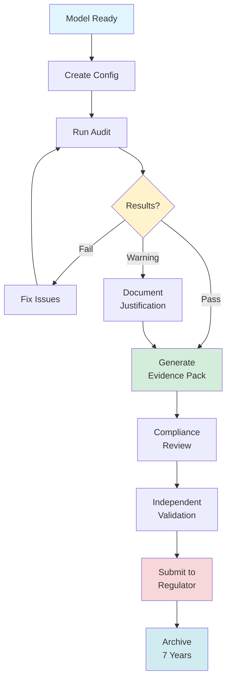

# Compliance Overview

Welcome to GlassAlpha compliance documentation. This guide helps you find the right resources for your role and industry.

## Compliance Workflow at a Glance



**Key stages:**

1. **Configuration** - Define model, data, protected attributes, policy gates
2. **Execution** - Run audit with `--strict` mode for regulatory compliance
3. **Review** - Analyze results, address failed gates, document warnings
4. **Evidence** - Export tamper-evident evidence pack with checksums
5. **Validation** - Independent review by validator or compliance officer
6. **Submission** - Submit to regulator with cover letter and verification instructions
7. **Archive** - Retain all artifacts per regulatory requirements (typically 7 years)

**Quick links:**

- [Compliance Readiness Checklist](compliance-readiness-checklist.md) - Pre-submission verification
- [Compliance Officer Workflow](../guides/compliance-workflow.md) - Detailed process
- [Model Validator Workflow](../guides/validator-workflow.md) - Independent verification

## Quick Navigation

### By Industry

Choose your industry for specific regulatory guidance:

- **[Banking & Credit](banking-guide.md)** - SR 11-7, ECOA, FCRA compliance
- **[Insurance](insurance-guide.md)** - NAIC Model Act #670, rate fairness
- **[Healthcare](healthcare-guide.md)** - HIPAA, health equity mandates
- **[Fraud Detection](fraud-guide.md)** - FCRA adverse action, FTC fairness

### By Role

Choose your role for workflow-specific guidance:

- **[ML Engineers](../guides/ml-engineer-workflow.md)** - Implementation, CI integration, debugging
- **[Compliance Officers](../guides/compliance-workflow.md)** - Evidence packs, policy gates, regulator communication
- **[Model Validators](../guides/validator-workflow.md)** - Verification, challenge, independent review

## Which Regulations Apply to You?

Use this table to determine which regulations govern your ML system based on geography, industry, and use case.

| Regulation                 | Geography      | Industry          | Use Case                                                             | GlassAlpha Coverage | Detailed Guide                            |
| -------------------------- | -------------- | ----------------- | -------------------------------------------------------------------- | ------------------- | ----------------------------------------- |
| **SR 11-7**                | United States  | Banking           | Model Risk Management (credit, fraud, collections)                   | ✅ Full             | [SR 11-7 Mapping](sr-11-7-mapping.md)     |
| **ECOA / Reg B**           | United States  | Credit/Lending    | Credit decisions (loans, cards, mortgages)                           | ✅ Full             | [Banking Guide](banking-guide.md)         |
| **FCRA**                   | United States  | Credit/Background | Adverse actions (credit denials, employment screening)               | ✅ Full             | [Banking Guide](banking-guide.md)         |
| **EU AI Act**              | European Union | High-Risk AI      | Credit scoring, employment, law enforcement, critical infrastructure | ⚠️ Partial          | [EU AI Act Mapping](eu-ai-act-mapping.md) |
| **GDPR Article 22**        | European Union | All               | Automated decision-making with legal/significant effects             | ✅ Full             | [EU AI Act Mapping](eu-ai-act-mapping.md) |
| **NAIC Model #870**        | United States  | Insurance         | Underwriting, pricing, claims (all states)                           | ✅ Full             | [Insurance Guide](insurance-guide.md)     |
| **California SB 221**      | California     | Insurance         | Life insurance algorithmic underwriting                              | ✅ Full             | [Insurance Guide](insurance-guide.md)     |
| **Colorado SB21-169**      | Colorado       | Insurance         | External consumer data in underwriting                               | ✅ Full             | [Insurance Guide](insurance-guide.md)     |
| **HIPAA**                  | United States  | Healthcare        | Protected Health Information (PHI)                                   | ⚠️ Partial          | [Healthcare Guide](healthcare-guide.md)   |
| **21st Century Cures Act** | United States  | Healthcare        | Clinical decision support systems                                    | ⚠️ Partial          | [Healthcare Guide](healthcare-guide.md)   |
| **FTC Act Section 5**      | United States  | All               | Unfair or deceptive practices                                        | ✅ Full             | [Fraud Guide](fraud-guide.md)             |

### Coverage Legend

- **✅ Full**: GlassAlpha provides all required artifacts and validation
- **⚠️ Partial**: Core fairness/explainability covered, but additional domain-specific requirements may apply
- **❌ Not Covered**: Requires specialized tools or manual processes

### Key Compliance Requirements by Regulation

**Banking (SR 11-7)**:

- Model risk management framework
- Independent validation
- Conceptual soundness documentation
- Ongoing monitoring
- **GlassAlpha provides**: Audit reports, policy gates, manifest provenance, validator workflow

**Credit (ECOA/FCRA)**:

- Adverse action notices with reason codes
- Disparate impact testing
- Fair lending compliance
- **GlassAlpha provides**: Reason codes, fairness metrics, demographic parity analysis

**EU AI Act (High-Risk Systems)**:

- Fundamental rights impact assessment
- Data governance and quality
- Transparency and user information
- Human oversight mechanisms
- **GlassAlpha provides**: Explainability (SHAP), fairness metrics, audit documentation, manifest

**Insurance (NAIC #870)**:

- Algorithm documentation
- Ongoing monitoring
- Discriminatory effect testing
- Consumer transparency
- **GlassAlpha provides**: Fairness analysis, rate fairness metrics, calibration testing

**Healthcare (HIPAA)**:

- PHI de-identification
- Access controls and audit logs
- Health equity considerations
- **GlassAlpha provides**: De-identified analytics, fairness across demographics

### Multi-Jurisdiction Scenarios

**Example 1: US Bank with EU Customers**

- Primary: SR 11-7 (US banking)
- Secondary: GDPR Article 22 (EU customers)
- **Solution**: Run audit with both `financial_services` and `eu_ai_act` profiles

**Example 2: Insurance Company (Multi-State)**

- Primary: NAIC Model #870 (all states)
- State-Specific: California SB 221, Colorado SB21-169
- **Solution**: Use `insurance` profile + state-specific fairness thresholds

**Example 3: Healthcare AI (Clinical Decision Support)**

- Primary: HIPAA (data protection)
- Secondary: 21st Century Cures Act (clinical validation)
- **Solution**: De-identify data, use `healthcare` profile, supplement with clinical validation

### Determining Your Requirements

1. **Geography**: Where are your users located?
2. **Industry**: Which sector are you operating in?
3. **Use Case**: What decisions does your model make?
4. **Data Sensitivity**: Do you handle protected data (PHI, PII)?
5. **Impact**: What are the consequences of model errors?

**Not sure?** Start with the [Compliance Readiness Checklist](compliance-readiness-checklist.md) to identify your requirements.

## Decision Tree

Not sure where to start? Follow this decision tree:

```
┌─────────────────────────────────────┐
│ What do you need to accomplish?    │
└─────────────────────────────────────┘
                 │
        ┌────────┴─────────┐
        │                  │
    Implement          Verify/Review
    an audit           an audit
        │                  │
        ▼                  ▼
┌───────────────┐    ┌───────────────┐
│ ML Engineer   │    │ Compliance    │
│ Workflow      │    │ Officer or    │
│               │    │ Validator     │
└───────────────┘    └───────────────┘
        │                  │
        │            ┌─────┴──────┐
        │            │            │
        │         Submit to   Independent
        │         regulator   review
        │            │            │
        │            ▼            ▼
        │      ┌──────────┐  ┌──────────┐
        │      │Compliance│  │Validator │
        │      │Workflow  │  │Workflow  │
        │      └──────────┘  └──────────┘
        │
        ▼
┌─────────────────────────────────────┐
│ What industry?                      │
├─────────────────────────────────────┤
│ • Banking/Credit → Banking Guide    │
│ • Insurance → Insurance Guide       │
│ • Healthcare → Healthcare Guide     │
│ • Fraud Detection → Fraud Guide     │
│ • Other → Quickstart Guide          │
└─────────────────────────────────────┘
```

## Common Scenarios

### Scenario 1: "I need to pass an SR 11-7 audit"

**Your role**: Compliance officer or risk manager at a bank

**Path**:

1. Start with [Banking Compliance Guide](banking-guide.md)
2. Review [SR 11-7 Technical Mapping](sr-11-7-mapping.md) for clause-by-clause coverage
3. Work with ML team using [ML Engineer Workflow](../guides/ml-engineer-workflow.md)
4. Generate evidence pack using [Compliance Officer Workflow](../guides/compliance-workflow.md)

**Key artifacts**: Audit PDF, evidence pack, policy decision log

### Scenario 2: "I need to integrate audits into CI/CD"

**Your role**: ML engineer or data scientist

**Path**:

1. Start with [ML Engineer Workflow](../guides/ml-engineer-workflow.md)
2. Review industry-specific requirements ([Banking](banking-guide.md) / [Insurance](insurance-guide.md) / [Healthcare](healthcare-guide.md))
3. Set up policy gates with [Compliance Workflow](../guides/compliance-workflow.md)
4. Implement pre-commit hooks or GitHub Actions

**Key features**: Policy gates, CLI automation, deterministic outputs

### Scenario 3: "I need to validate someone else's audit"

**Your role**: Internal auditor, model validator, third-party consultant

**Path**:

1. Start with [Model Validator Workflow](../guides/validator-workflow.md)
2. Review relevant industry guide for regulatory context
3. Verify evidence pack integrity
4. Challenge findings using checklist

**Key features**: Evidence pack verification, reproducibility checks, red flag detection

### Scenario 4: "I need to explain a credit denial"

**Your role**: Compliance officer responding to consumer inquiry

**Path**:

1. Review [Banking Compliance Guide](banking-guide.md) - ECOA requirements
2. Generate reason codes with [Reason Codes Guide](../guides/reason-codes.md)
3. Optionally provide recourse with [Recourse Guide](../guides/recourse.md)

**Key artifacts**: Adverse action notice with specific reasons

### Scenario 5: "I need to test model robustness"

**Your role**: Risk manager or model validator

**Path**:

1. Review [Shift Testing Guide](../guides/shift-testing.md)
2. Apply demographic shift scenarios
3. Document results in audit report

**Key features**: `--check-shift` flag, stress testing, scenario analysis

## Regulatory Framework Coverage

### Banking & Finance

- **SR 11-7** (Federal Reserve): Model risk management
- **ECOA** (CFPB): Equal credit opportunity
- **FCRA** (FTC): Fair credit reporting
- **Fair Lending Laws**: Anti-discrimination requirements

**See**: [Banking Compliance Guide](banking-guide.md)

### Insurance

- **NAIC Model Act #670**: Prohibition on unfair discrimination
- **State regulations**: Varies by jurisdiction (CA, NY, etc.)
- **Anti-discrimination laws**: Protected characteristics in underwriting

**See**: [Insurance Compliance Guide](insurance-guide.md)

### Healthcare

- **HIPAA**: Privacy and security of health information
- **Health equity mandates**: CMS quality measures, state requirements
- **Clinical validation**: IRB requirements, informed consent

**See**: [Healthcare Compliance Guide](healthcare-guide.md)

### Cross-Industry

- **GDPR Article 22**: Right to explanation (EU)
- **AI Act** (EU): High-risk AI systems
- **FTC guidance**: Algorithmic fairness, consumer protection
- **CCPA** (California): Consumer privacy rights

**See**: Industry-specific guides for details

## Core Capabilities

### Audit Reports

Comprehensive PDF reports covering:

- Model documentation and validation testing
- Performance metrics with statistical confidence intervals
- Fairness analysis (group and individual)
- Calibration testing (predicted vs actual outcomes)
- Explainability (SHAP values, feature contributions)
- Reason codes (ECOA-compliant adverse action notices)
- Recourse analysis (counterfactual recommendations)
- Dataset bias detection
- Robustness testing (demographic shifts, adversarial perturbations)

### Evidence Packs

Tamper-evident zip files containing:

- Audit PDF
- Provenance manifest (hashes, versions, seeds)
- Policy decision log (pass/fail for each gate)
- Configuration files
- Dataset schema
- SHA256 checksums for integrity verification

### Policy-as-Code Gates

Define compliance thresholds in YAML:

- Minimum calibration accuracy
- Maximum fairness metric values
- Required sample sizes
- Robustness requirements

Automatically fail non-compliant models in CI/CD.

### Reproducibility

Byte-identical outputs under same conditions:

- Explicit random seeds
- Package version tracking
- Data hashing (SHA256)
- Git commit tracking
- Platform-independent determinism

## Getting Started

### For First-Time Users

1. **Install**: `pip install glassalpha`
2. **Quickstart**: [60-second audit tutorial](../getting-started/quickstart.md)
3. **Choose path**: Industry guide or role workflow
4. **Run audit**: `glassalpha audit --config audit.yaml --output report.pdf`

### For Experienced Users

- [CLI Reference](../reference/cli.md) - All commands and options
- [Configuration Guide](../getting-started/configuration.md) - Advanced config
- [Troubleshooting](../reference/troubleshooting.md) - Common issues

## Support

### Documentation

- **Getting Started**: [Installation](../getting-started/installation.md) | [Quickstart](../getting-started/quickstart.md) | [Configuration](../getting-started/configuration.md)
- **Examples**: [German Credit](../examples/german-credit-audit.md) | [Healthcare Bias](../examples/healthcare-bias-detection.md) | [Fraud Detection](../examples/fraud-detection-audit.md)
- **Reference**: [CLI](../reference/cli.md) | [Fairness Metrics](../reference/fairness-metrics.md) | [Calibration](../reference/calibration.md)

### Community

- **GitHub**: [GlassAlpha/glassalpha](https://github.com/GlassAlpha/glassalpha)
- **Discussions**: [Ask questions, share use cases](https://github.com/GlassAlpha/glassalpha/discussions)
- **Issues**: [Report bugs, request features](https://github.com/GlassAlpha/glassalpha/issues)

### Contact

- **Email**: [contact@glassalpha.com](mailto:contact@glassalpha.com)
- **Website**: [glassalpha.com](https://glassalpha.com)

## Next Steps

Choose your path:

- **Banking teams** → [Banking Compliance Guide](banking-guide.md)
- **Insurance teams** → [Insurance Compliance Guide](insurance-guide.md)
- **Healthcare teams** → [Healthcare Compliance Guide](healthcare-guide.md)
- **ML engineers** → [ML Engineer Workflow](../guides/ml-engineer-workflow.md)
- **Compliance officers** → [Compliance Officer Workflow](../guides/compliance-workflow.md)
- **Model validators** → [Model Validator Workflow](../guides/validator-workflow.md)
