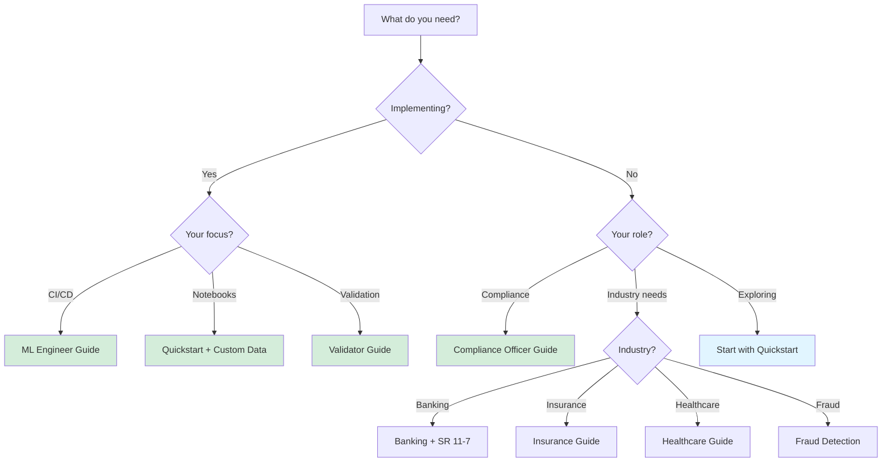

# Feature overview

## Which guide do I need?



**Quick navigation:**

- **Implementing audits?** → [ML Engineer Workflow](../guides/ml-engineer-workflow.md) for CI/CD and debugging
- **Exploring in notebooks?** → [Quick Start](quickstart.md) + [Custom Data Guide](custom-data.md)
- **Need evidence for regulators?** → [Compliance Officer Workflow](../guides/compliance-workflow.md)
- **Industry-specific guidance?** → [Banking](../compliance/banking-guide.md) | [Insurance](../compliance/insurance-guide.md) | [Healthcare](../compliance/healthcare-guide.md)
- **Independent verification?** → [Model Validator Workflow](../guides/validator-workflow.md)

## Quick reference

GlassAlpha capabilities and where to learn more:

| Feature                     | Guide                                                                            | Reference                                                                        | Compliance                                           |
| --------------------------- | -------------------------------------------------------------------------------- | -------------------------------------------------------------------------------- | ---------------------------------------------------- |
| **Group Fairness**          | [Configuration](configuration.md#fairness-analysis-with-statistical-confidence)  | [Fairness Metrics](../reference/fairness-metrics.md)                             | [SR 11-7 §V](../compliance/sr-11-7-mapping.md)       |
| **Intersectional Fairness** | [Configuration](configuration.md#fairness-analysis-with-statistical-confidence)  | [Fairness Metrics](../reference/fairness-metrics.md#intersectional-fairness-e51) | [SR 11-7 §V](../compliance/sr-11-7-mapping.md)       |
| **Individual Fairness**     | [Configuration](configuration.md#fairness-analysis-with-statistical-confidence)  | [Fairness Metrics](../reference/fairness-metrics.md#individual-fairness-e11)     | [SR 11-7 §V](../compliance/sr-11-7-mapping.md)       |
| **Dataset Bias**            | [Detection Guide](../guides/dataset-bias.md)                                     | -                                                                                | [SR 11-7 §III.C.2](../compliance/sr-11-7-mapping.md) |
| **Calibration**             | [Configuration](configuration.md#calibration-analysis-with-confidence-intervals) | [Calibration Reference](../reference/calibration.md)                             | [SR 11-7 §III.B.2](../compliance/sr-11-7-mapping.md) |
| **Robustness**              | [Configuration](configuration.md#robustness-testing-adversarial-perturbations)   | [Robustness Reference](../reference/robustness.md)                               | EU AI Act Art. 15                                    |
| **Shift Testing**           | [Shift Testing Guide](../guides/shift-testing.md)                                | -                                                                                | [SR 11-7 §III.A.3](../compliance/sr-11-7-mapping.md) |
| **Reason Codes**            | [Reason Codes Guide](../guides/reason-codes.md)                                  | -                                                                                | ECOA §701(d)                                         |
| **Preprocessing**           | [Preprocessing Guide](../guides/preprocessing.md)                                | -                                                                                | [SR 11-7 §III.C.1](../compliance/sr-11-7-mapping.md) |

## Why choose GlassAlpha?

### How GlassAlpha compares

| Feature                   | GlassAlpha                      | Fairlearn        | AIF360               | Commercial Tools     |
| ------------------------- | ------------------------------- | ---------------- | -------------------- | -------------------- |
| **Audit PDFs**            | ✅ Professional, byte-identical | ❌ No reports    | ❌ No reports        | ✅ $$$               |
| **Custom Data in 5 min**  | ✅ Yes                          | ⚠️ Complex setup | ⚠️ Complex setup     | ⚠️ Support needed    |
| **Built-in Datasets**     | ✅ 10+ ready to use             | ❌ None          | ⚠️ Few               | ✅ Limited           |
| **Model Support**         | ✅ XGBoost, LightGBM, sklearn   | ⚠️ sklearn only  | ⚠️ Limited           | ✅ Varies            |
| **Deterministic Results** | ✅ Byte-identical PDFs          | ⚠️ Partial       | ❌ No                | ⚠️ Varies            |
| **Offline/Air-gapped**    | ✅ 100% offline                 | ✅ Yes           | ✅ Yes               | ❌ Requires internet |
| **Cost**                  | ✅ Free (Apache 2.0)            | ✅ Free (MIT)    | ✅ Free (Apache 2.0) | 💰 $5K-$50K+         |
| **Regulatory Ready**      | ✅ Audit trails + manifests     | ❌ No trails     | ❌ No trails         | ✅ $$$               |
| **Learning Curve**        | ✅ 60-second start              | ⚠️ Steep         | ⚠️ Steep             | ⚠️ Training needed   |

**Bottom line**: GlassAlpha is the only OSS tool that combines professional audit PDFs, easy custom data support, and complete regulatory compliance—all in a 60-second setup.

## Designed for regulatory compliance

- **Deterministic outputs** - Identical PDFs on same seed/data/model
- **Complete lineage** - Git SHA, config hash, data hash, seeds recorded
- **Professional formatting** - Publication-quality reports with visualizations
- **Audit trails** - Immutable run manifests for regulatory submission

[See compliance mapping →](../compliance/sr-11-7-mapping.md)

## On-premise first design

- **No external dependencies** - Runs completely offline
- **File-based approach** - No databases or complex infrastructure needed
- **Full reproducibility** - Immutable run manifests for audit trails
- **Air-gapped compatible** - Works without internet access

[See trust & deployment details →](../reference/trust-deployment.md)

## Simplicity as a core principle

- **Single command** - `glassalpha audit` handles everything
- **YAML configuration** - Policy-as-code for compliance requirements
- **Fast execution** - Under 60 seconds from model to PDF
- **Clear errors** - Actionable messages with fix suggestions

[See configuration guide →](configuration.md)

## Supported models

| Model Type          | Status     | Notes                           |
| ------------------- | ---------- | ------------------------------- |
| XGBoost             | Production | TreeSHAP integration optimized  |
| LightGBM            | Production | Native integration available    |
| Logistic Regression | Production | Full scikit-learn compatibility |

Additional model types available through extension framework.

[See model selection guide →](../reference/model-selection.md)

## Example configuration

Working configuration structure:

```yaml
audit_profile: german_credit_default

data:
  path: data/german_credit_processed.csv
  target_column: credit_risk
  protected_attributes:
    - gender
    - age_group
    - foreign_worker

model:
  type: xgboost
  params:
    objective: binary:logistic
    n_estimators: 100
    max_depth: 5

explainers:
  strategy: first_compatible
  priority:
    - treeshap
    - kernelshap

metrics:
  performance:
    metrics:
      - accuracy
      - precision
      - recall
      - f1
      - auc_roc
  fairness:
    metrics:
      - demographic_parity
      - equal_opportunity

reproducibility:
  random_seed: 42
```

This configuration format supports deterministic, reproducible audits.

[See full configuration reference →](configuration.md)

## Contributing

We welcome contributions to enhance GlassAlpha's capabilities:

### Enhancement areas

1. **Additional models** - Neural networks, time series, custom integrations
2. **Advanced explanations** - Counterfactuals, gradient methods, interactive visuals
3. **Extended compliance** - Additional frameworks, custom templates, industry metrics
4. **Performance** - Large dataset optimization, parallel processing
5. **Documentation** - Examples, tutorials, best practices

[See contribution guidelines →](../reference/contributing.md)
