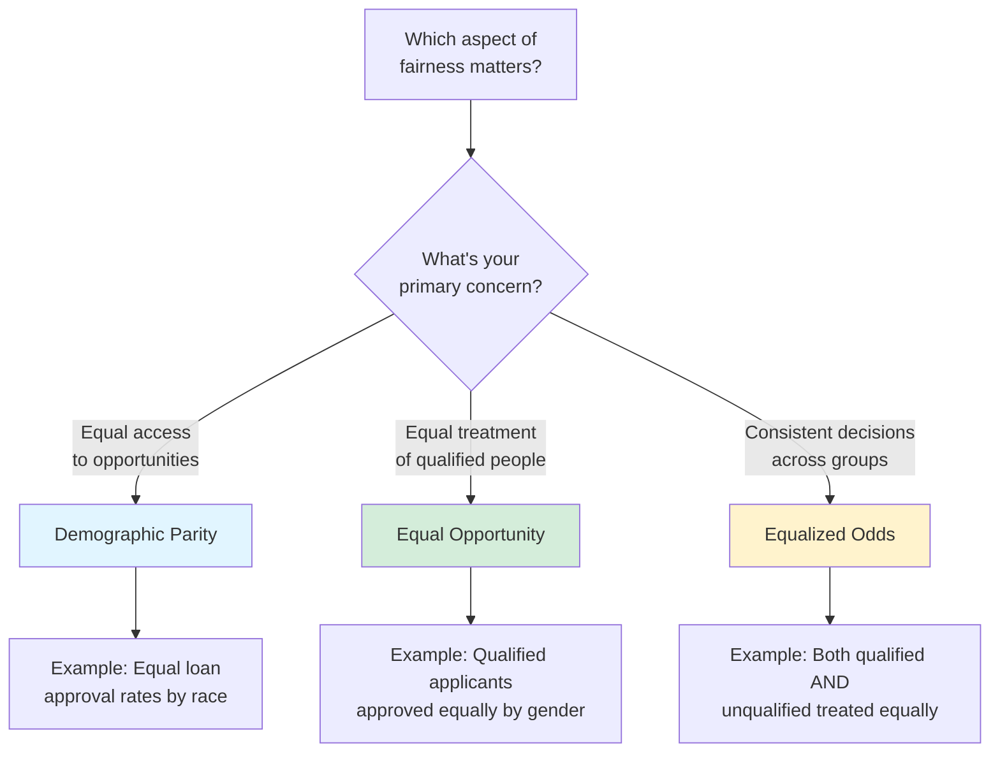
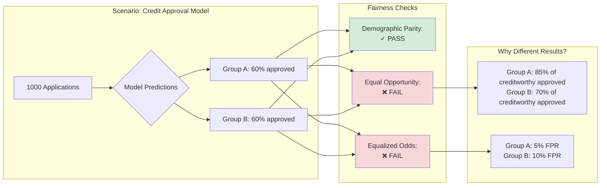
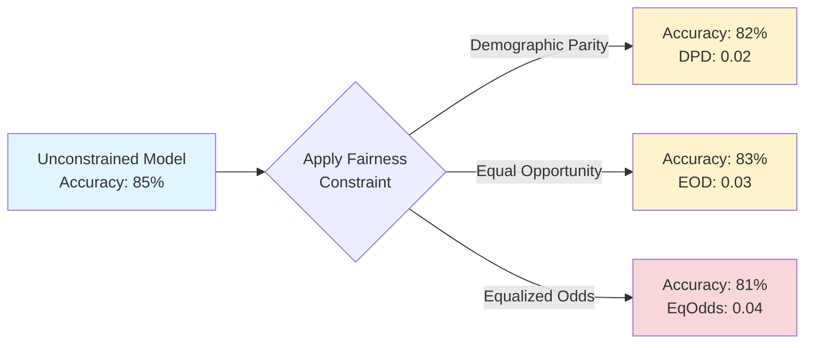

# Fairness 101: Understanding ML Fairness Metrics

A plain-language guide to fairness in machine learning for data scientists, compliance officers, and anyone building or auditing ML systems.

---

## What is fairness in ML?

**Fairness in machine learning** means ensuring that predictions don't systematically disadvantage specific groups of people based on sensitive attributes like race, gender, age, or disability status.

**The challenge**: There are multiple definitions of fairness, and **they often conflict**. A model can be fair by one definition but unfair by another. This guide helps you choose the right metric for your use case.

---

## The three core fairness definitions

GlassAlpha implements the three most widely-used fairness metrics. Here's what they mean in plain language:



---

### 1. Demographic Parity (Statistical Parity)

**Definition**: Groups receive positive outcomes at equal rates.

**Formula**: `P(Ŷ=1 | Group A) ≈ P(Ŷ=1 | Group B)`

**Example**: In a credit model, 60% of men and 60% of women are approved for loans.

**When to use**:

- ✅ You want equal access to opportunities (hiring, lending, housing)
- ✅ Historical discrimination has led to unequal base rates
- ✅ Regulators emphasize equal treatment regardless of group membership

**When NOT to use**:

- ❌ Groups have genuinely different base rates (e.g., disease prevalence)
- ❌ You need to optimize accuracy (demographic parity often reduces performance)
- ❌ The outcome variable itself is biased (e.g., arrest rates reflecting policing bias)

**Real-world example**:

```
Hiring Model (Demographic Parity)
====================================
Group           Applications    Hired   Rate
────────────────────────────────────────────
Men             1000            200     20%
Women           800             160     20%  ✓ Equal rates
Non-binary      100             20      20%  ✓ Equal rates
====================================
Status: PASS (all groups within 5% tolerance)
```

**Regulatory context**:

- **ECOA (US Credit)**: Often interpreted to require demographic parity in lending outcomes
- **GDPR Article 22 (EU)**: Emphasizes non-discrimination in automated decisions
- **FTC Act Section 5**: Unequal rates can trigger "unfair practices" scrutiny

---

### 2. Equal Opportunity

**Definition**: Among qualified individuals (true positives), groups are selected at equal rates.

**Formula**: `P(Ŷ=1 | Y=1, Group A) ≈ P(Ŷ=1 | Y=1, Group B)`

**Example**: Among creditworthy borrowers, 85% of men and 85% of women are approved.

**When to use**:

- ✅ You care about true positives (qualified people getting opportunities)
- ✅ False positives are less harmful than false negatives
- ✅ The positive outcome is a benefit (job, loan, treatment)

**When NOT to use**:

- ❌ False positives are costly (fraud detection, criminal justice)
- ❌ You need to control both false positives AND false negatives
- ❌ Ground truth labels are unreliable or biased

**Real-world example**:

```
Credit Model (Equal Opportunity)
====================================
Group      Creditworthy    Approved    True Positive Rate
──────────────────────────────────────────────────────────
Men        500             425         85%
Women      400             340         85%  ✓ Equal TPR
────────────────────────────────────────────────────────
Status: PASS (TPR difference < 10%)
```

**Key insight**: Equal opportunity **ignores what happens to unqualified people**. If your model wrongly denies 10% of qualified men but 30% of qualified women, that violates equal opportunity even if overall approval rates are the same.

**Regulatory context**:

- **SR 11-7 (Banking)**: Focuses on minimizing errors for creditworthy borrowers
- **FCRA (Adverse Actions)**: Requires explanations when qualified applicants are denied
- **EU AI Act**: High-risk systems must minimize false negatives for protected groups

---

### 3. Equalized Odds

**Definition**: Both true positive rates AND false positive rates are equal across groups.

**Formula**:

- `P(Ŷ=1 | Y=1, Group A) ≈ P(Ŷ=1 | Y=1, Group B)` (TPR)
- `P(Ŷ=1 | Y=0, Group A) ≈ P(Ŷ=1 | Y=0, Group B)` (FPR)

**Example**: Among creditworthy borrowers, 85% approved regardless of gender. Among non-creditworthy borrowers, 5% wrongly approved regardless of gender.

**When to use**:

- ✅ Both false positives and false negatives are harmful
- ✅ You need consistent error rates across groups
- ✅ High-stakes decisions (criminal justice, medical diagnosis, fraud)

**When NOT to use**:

- ❌ False positives and false negatives have very different costs
- ❌ You only care about one type of error
- ❌ Group sizes are very imbalanced (harder to achieve)

**Real-world example**:

```
Fraud Detection (Equalized Odds)
====================================
Group          TPR    FPR    Status
────────────────────────────────────
Age 18-35      92%    3%     ✓
Age 36-55      90%    3%     ✓ Equal FPR
Age 56+        91%    4%     ⚠️ FPR too high
────────────────────────────────────
Status: WARNING (FPR disparity in Age 56+)
```

**Key insight**: Equalized odds is the **most stringent** fairness metric. If you pass equalized odds, you typically pass equal opportunity and are close to demographic parity.

**Regulatory context**:

- **Criminal Justice Reform**: COMPAS case highlighted FPR disparities
- **Insurance Underwriting**: NAIC Model #870 requires equal error rates
- **Healthcare**: 21st Century Cures Act emphasizes balanced error rates

---

## Visual comparison: which metric detects what?



**The punchline**: A model can have equal approval rates (demographic parity ✓) but still treat qualified people unfairly (equal opportunity ❌) or have inconsistent error rates (equalized odds ❌).

---

## Concrete example: hiring model

Let's analyze a hiring model across all three metrics:

### Dataset

- **1000 applications**: 600 men, 400 women
- **300 qualified candidates**: 200 men, 100 women
- **100 hired**: Model selects top candidates

### Scenario A: perfectly fair model

```
                Men     Women   Difference
─────────────────────────────────────────────
Approval Rate   16.7%   16.7%   0.0%   ✓ Demographic Parity
TPR (Qualified) 85%     85%     0.0%   ✓ Equal Opportunity
FPR (Unqualif.) 2%      2%      0.0%   ✓ Equalized Odds
─────────────────────────────────────────────
Status: PASS all fairness metrics
```

### Scenario B: demographic parity only

```
                Men     Women   Difference
─────────────────────────────────────────────
Approval Rate   16.7%   16.7%   0.0%   ✓ Demographic Parity
TPR (Qualified) 90%     70%     20%    ❌ Equal Opportunity (FAIL)
FPR (Unqualif.) 3%      8%      5%     ❌ Equalized Odds (FAIL)
─────────────────────────────────────────────
Status: FAIL (qualified women disadvantaged)
```

**What happened**: To maintain equal approval rates despite discriminatory scoring, the model approved more unqualified women (high FPR) while rejecting more qualified women (low TPR). This is **quota-filling without fairness**.

### Scenario C: equal opportunity only

```
                Men     Women   Difference
─────────────────────────────────────────────
Approval Rate   20%     10%     10%    ❌ Demographic Parity (FAIL)
TPR (Qualified) 85%     85%     0.0%   ✓ Equal Opportunity
FPR (Unqualif.) 5%      1%      4%     ❌ Equalized Odds (FAIL)
─────────────────────────────────────────────
Status: PARTIAL (qualified treated equally, but unequal access)
```

**What happened**: Qualified candidates are treated equally, but men have higher overall approval rates because the model is more lenient with unqualified men (higher FPR).

---

## How GlassAlpha measures fairness

GlassAlpha reports all three metrics in every audit:

```yaml
fairness:
  demographic_parity_difference: 0.05 # |P(Ŷ=1|A) - P(Ŷ=1|B)|
  equal_opportunity_difference: 0.03 # |TPR_A - TPR_B|
  equalized_odds_difference: 0.04 # max(|TPR_A - TPR_B|, |FPR_A - FPR_B|)

  # Per-group breakdown
  groups:
    male:
      selection_rate: 0.45
      true_positive_rate: 0.88
      false_positive_rate: 0.03
    female:
      selection_rate: 0.40 # 5% difference → demographic parity
      true_positive_rate: 0.85 # 3% difference → equal opportunity
      false_positive_rate: 0.07 # 4% difference → equalized odds
```

**Interpretation thresholds** (industry standard):

- **< 5%**: Minimal disparity (generally acceptable)
- **5-10%**: Moderate disparity (review required)
- **> 10%**: Substantial disparity (regulatory risk)

---

## Decision matrix: which metric should you use?

Use this table to choose the right fairness metric for your use case:

| Use Case                   | Primary Metric      | Secondary Metric   | Why                                                                 |
| -------------------------- | ------------------- | ------------------ | ------------------------------------------------------------------- |
| **Credit/Lending**         | Demographic Parity  | Equal Opportunity  | ECOA requires equal access; SR 11-7 emphasizes creditworthy lending |
| **Hiring**                 | Equal Opportunity   | Demographic Parity | Qualified candidates should have equal chances                      |
| **Fraud Detection**        | Equalized Odds      | -                  | Both false positives (customer friction) and false negatives (loss) |
| **Criminal Justice**       | Equalized Odds      | -                  | False positives (wrongful detention) and false negatives (risk)     |
| **Healthcare Diagnosis**   | Equalized Odds      | Equal Opportunity  | Balanced error rates critical for patient safety                    |
| **Insurance Underwriting** | Equalized Odds      | Demographic Parity | NAIC Model #870 requires consistent error rates                     |
| **College Admissions**     | Equal Opportunity   | Demographic Parity | Qualified applicants should have equal chances                      |
| **Content Moderation**     | Equalized Odds      | -                  | Both over-moderation and under-moderation harmful                   |
| **Advertising Targeting**  | Demographic Parity  | -                  | Equal exposure to opportunities                                     |
| **Predictive Policing**    | ⚠️ All metrics fail | -                  | Historical data reflects biased enforcement (avoid ML)              |

**Rule of thumb**:

- **Opportunities** (loans, jobs) → Start with equal opportunity
- **Harmful outcomes** (fraud, risk) → Use equalized odds
- **Access-based** (ads, housing) → Use demographic parity

---

## The impossibility theorem

**Important**: You usually **cannot satisfy all three metrics simultaneously** unless:

1. Base rates are equal across groups (rare in real data), OR
2. Your model has perfect accuracy (impossible)

**Proof by example**:

- **Base rates**: Group A has 50% qualified, Group B has 30% qualified
- **Demographic parity** requires equal approval rates (e.g., 40% each)
- **Equal opportunity** requires equal TPR (e.g., 80% of qualified approved in both groups)
- **Math**: Group A approves 80% × 50% = 40% (matches parity) ✓
- **Math**: Group B approves 80% × 30% = 24% (doesn't match parity) ❌

**Takeaway**: You must **choose which fairness definition matters most** for your use case. Document this choice in your audit policy.

---

## Fairness vs accuracy tradeoffs

Enforcing fairness constraints typically reduces overall accuracy:



**Why this happens**:

1. **Optimal decision boundaries** differ by group when base rates differ
2. **Fairness constraints** force the model to use a common boundary
3. **Result**: Some groups get less-than-optimal predictions

**Practical guidance**:

- **2-3% accuracy drop**: Typical and acceptable
- **5-10% accuracy drop**: Review if fairness constraint is appropriate
- **>10% accuracy drop**: Investigate data quality or model architecture issues

**Exception**: If accuracy improves with fairness constraints, your model was likely overfitting to spurious correlations with protected attributes.

---

## Beyond group fairness: individual fairness

The metrics above measure **group fairness** (comparing groups). GlassAlpha also supports **individual fairness**:

**Definition**: Similar individuals should receive similar predictions.

**Example**: Two loan applicants with identical income, debt, and credit history should get similar scores, regardless of race or gender.

**Metrics**:

- **Consistency Score**: How often similar individuals get similar predictions
- **Individual Treatment Disparity**: Average prediction difference for matched pairs

**When to use**:

- ✅ You have matched pairs or can construct them
- ✅ You want to catch one-off discriminatory decisions
- ✅ Regulators ask about "similarly situated" applicants (ECOA, FCRA)

**Learn more**: [Individual Fairness Metrics](../reference/fairness-metrics.md)

---

## Intersectional fairness

**Warning**: Analyzing single attributes (gender alone, race alone) can hide discrimination at intersections.

**Example**:

```
Single-attribute analysis (PASS):
  Men:     60% approval
  Women:   60% approval  ✓ Equal rates

  White:   60% approval
  Black:   60% approval  ✓ Equal rates

Intersectional analysis (FAIL):
  White Men:    70% approval
  White Women:  50% approval
  Black Men:    50% approval
  Black Women:  30% approval  ❌ 40% disparity
```

**GlassAlpha supports intersectional analysis**:

```yaml
fairness:
  intersectional:
    enabled: true
    combinations:
      - [gender, race]
      - [age_group, income_bracket]
```

**Learn more**: [Intersectional Fairness Guide](../reference/fairness-metrics.md#intersectional-analysis)

---

## Common pitfalls

### 1. "We removed protected attributes, so we're fair"

**Wrong**: Correlated features (zip code, name, education) can serve as proxies.

**Solution**: Test fairness metrics even when protected attributes aren't model inputs.

### 2. "Our overall accuracy is high, so we're good"

**Wrong**: High accuracy can coexist with large group disparities.

**Example**: 95% accuracy but 30% gap in false negative rates for minorities.

**Solution**: Always report fairness metrics alongside accuracy.

### 3. "We balanced our training data by group"

**Wrong**: Balancing data helps but doesn't guarantee fair predictions.

**Solution**: Measure fairness on test set predictions, not training set composition.

### 4. "We have equal error rates within each group"

**Wrong**: This checks calibration, not fairness.

**Solution**: Compare error rates ACROSS groups (equalized odds).

### 5. "We used a neutral dataset without bias"

**Wrong**: No dataset is truly neutral; historical data reflects societal biases.

**Solution**: Acknowledge data limitations and test for bias regardless.

---

## Regulatory expectations by industry

Different industries emphasize different fairness metrics:

### Banking (SR 11-7, ECOA, FCRA)

- **Primary**: Demographic parity (equal access to credit)
- **Secondary**: Equal opportunity (creditworthy borrowers approved)
- **Threshold**: <10% disparity in approval rates or adverse action rates
- **Evidence**: Disparate impact analysis, counterfactual explanations

### Insurance (NAIC Model #870, California SB 221)

- **Primary**: Equalized odds (consistent error rates)
- **Secondary**: Calibration (accurate risk prediction within groups)
- **Threshold**: <5% difference in FPR/FNR by protected class
- **Evidence**: Actuarial justification for any disparities

### Healthcare (HIPAA, 21st Century Cures Act)

- **Primary**: Equalized odds (equal diagnostic accuracy)
- **Secondary**: Calibration (accurate risk scores for treatment decisions)
- **Threshold**: <5% disparity in sensitivity/specificity
- **Evidence**: Clinical validation studies by demographic subgroup

### Employment (EEOC, OFCCP)

- **Primary**: Equal opportunity (qualified candidates advance equally)
- **Secondary**: Demographic parity (equal access to interviews)
- **Threshold**: <20% relative difference (80% rule)
- **Evidence**: Adverse impact analysis, job-relatedness studies

**Learn more**: [Compliance Guides](../compliance/index.md)

---

## How to report fairness in audits

When presenting fairness results to stakeholders:

### For technical teams

```
Fairness Analysis (threshold=0.5, n=1000)
==========================================
Metric                    Value    Status    Threshold
──────────────────────────────────────────────────────
Demographic Parity Diff   0.08     WARN      <0.10
Equal Opportunity Diff    0.12     FAIL      <0.10
Equalized Odds Diff       0.14     FAIL      <0.10

Group-level breakdown:
  Male   (n=600): TPR=0.88, FPR=0.03, Selection=0.45
  Female (n=400): TPR=0.76, FPR=0.05, Selection=0.37

Action: Investigate equal opportunity violation (12% gap in TPR)
```

### For compliance officers

```
This model exhibits moderate to substantial fairness violations:

1. Demographic Parity: 8% gap in approval rates (ACCEPTABLE)
   - Male applicants: 45% approved
   - Female applicants: 37% approved

2. Equal Opportunity: 12% gap in true positive rates (UNACCEPTABLE)
   - Among qualified applicants, 88% of men approved
   - Among qualified applicants, 76% of women approved
   - Regulatory risk: Violates ECOA requirement for equal treatment

3. Recommendation: Recalibrate threshold or add fairness constraints
```

### For regulators

```
Disparate Impact Analysis (ECOA Compliance)
===========================================
Protected Class: Gender (Male vs Female)
Sample Size: 600 male, 400 female applicants
Time Period: Q4 2024

Finding: Substantial disparate impact detected
  - Adverse action rate (Male): 55%
  - Adverse action rate (Female): 63%
  - Relative difference: 14.5% (exceeds 10% tolerance)
  - Statistical significance: p < 0.001

Business necessity justification: Under review
Alternative methods with less disparity: Being evaluated

Evidence pack: SHA256 checksum attached
```

---

## Next steps

### Learn more

- [Understanding Protected Attributes](understanding-protected-attributes.md) - What makes an attribute "protected"
- [Debug Fairness Violations](how-to/debug-fairness-violations.md) - Step-by-step troubleshooting
- [Fairness Metrics Reference](../reference/fairness-metrics.md) - Technical definitions and individual fairness

### Try it yourself

- [Quickstart Guide](../getting-started/quickstart.md) - Generate your first fairness audit
- [German Credit Example](../examples/german-credit-audit.md) - Walkthrough with real data
- [Configuration Patterns](../getting-started/configuration-patterns.md) - Fairness thresholds by industry

### Regulatory compliance

- [Banking Compliance (SR 11-7)](../compliance/banking-guide.md)
- [Insurance Compliance (NAIC #870)](../compliance/insurance-guide.md)
- [Healthcare Compliance (HIPAA)](../compliance/healthcare-guide.md)

---

**Questions?** [Join our community](https://github.com/glassalpha/glassalpha/discussions) or [contact us](../contact.md).
