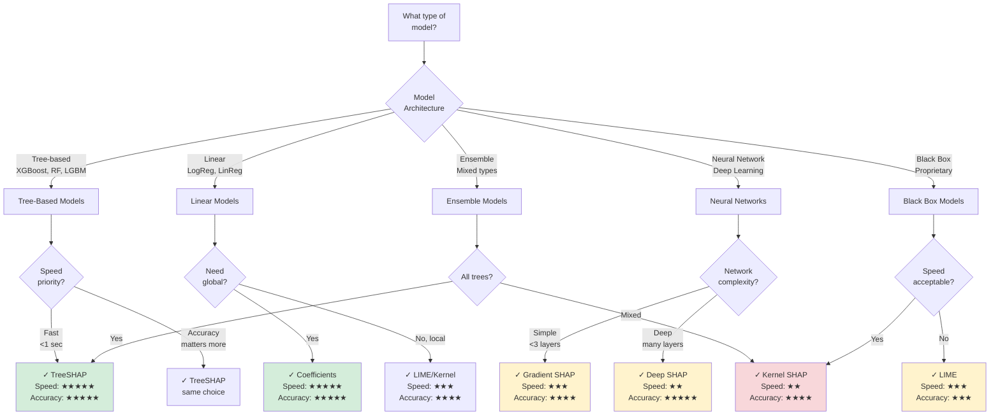
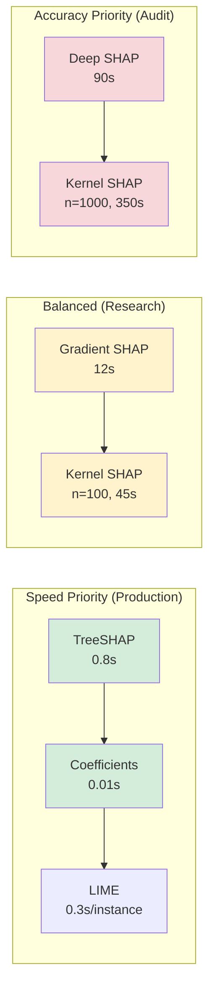

# How to Choose an Explainer

Decision guide for selecting the optimal explainability method for your ML model based on model type, speed requirements, and accuracy needs.

---

## Quick decision tree



---

## Explainer comparison matrix

| Explainer         | Model Types                                        | Speed | Accuracy | Local/Global | Best For                          |
| ----------------- | -------------------------------------------------- | ----- | -------- | ------------ | --------------------------------- |
| **TreeSHAP**      | XGBoost, LightGBM, RandomForest, DecisionTree      | ★★★★★ | ★★★★★    | Both         | Tree models (always use this)     |
| **Coefficients**  | LogisticRegression, LinearRegression, Ridge, Lasso | ★★★★★ | ★★★★★    | Global       | Linear models (built-in)          |
| **Kernel SHAP**   | Any model                                          | ★★    | ★★★★     | Local        | Complex ensembles, black boxes    |
| **LIME**          | Any model                                          | ★★★   | ★★★      | Local        | Quick approximations              |
| **Gradient SHAP** | Neural networks (with gradients)                   | ★★★   | ★★★★     | Local        | Simple neural networks            |
| **Deep SHAP**     | Deep neural networks                               | ★★    | ★★★★★    | Local        | Deep learning models              |
| **Permutation**   | Any model                                          | ★     | ★★★      | Global       | Model-agnostic feature importance |

**Speed ratings**: Time to explain 100 predictions on German Credit dataset (1000 rows, 20 features)

- ★★★★★ (<1 sec) - Real-time capable
- ★★★★ (1-5 sec) - Interactive
- ★★★ (5-30 sec) - Acceptable for batch
- ★★ (30-120 sec) - Batch only
- ★ (>120 sec) - Slow, use sparingly

---

## Detailed explainer guide

### TreeSHAP (recommended for tree models)

**What it is**: Optimized SHAP implementation for tree-based models using tree structure for exact calculation.

**When to use**:

- ✅ XGBoost, LightGBM, RandomForest, CatBoost, DecisionTree
- ✅ Need exact Shapley values (not approximations)
- ✅ Speed is critical (real-time explanations)
- ✅ Both local (instance-level) and global (feature importance)

**Performance**:

```python
# German Credit (1000 samples, 20 features)
XGBoost:        0.8 seconds   ★★★★★
RandomForest:   1.2 seconds   ★★★★★
LightGBM:       0.6 seconds   ★★★★★
```

**Accuracy**: ★★★★★ (exact Shapley values, theoretically grounded)

**Configuration**:

```yaml
explainer:
  method: treeshap
  config:
    feature_perturbation: tree_path_dependent # Default, most accurate
    check_additivity: true # Verify SHAP property
```

**Pros**:

- Fastest SHAP implementation
- Exact values (no sampling approximation)
- Scales to millions of trees
- Feature interactions captured accurately

**Cons**:

- Only works for tree models
- Memory intensive for very wide models (>1000 features)
- Doesn't explain transformations before tree (use preprocessing artifacts)

**Example**:

```python
import shap
from xgboost import XGBClassifier

model = XGBClassifier()
model.fit(X_train, y_train)

# TreeSHAP
explainer = shap.TreeExplainer(model)
shap_values = explainer.shap_values(X_test)  # Fast!

# Feature importance
shap.summary_plot(shap_values, X_test)
```

---

### Coefficients (Linear Models)

**What it is**: Model coefficients as feature importance (for linear models only).

**When to use**:

- ✅ LogisticRegression, LinearRegression, Ridge, Lasso, ElasticNet
- ✅ Need global interpretability
- ✅ Instant results (no computation)
- ✅ Regulatory requirement for "simple model"

**Performance**:

```python
# No computation (read from model)
Any size:  <0.01 seconds   ★★★★★
```

**Accuracy**: ★★★★★ (exact, built into model)

**Configuration**:

```yaml
explainer:
  method: coefficients
  config:
    normalize: true # Scale by feature std for comparability
```

**Pros**:

- Instant (no computation)
- Exact (not approximation)
- Globally interpretable
- Regulatory-friendly (simple models preferred)

**Cons**:

- Only for linear models
- Doesn't capture feature interactions
- Requires feature scaling for comparability
- Less powerful than tree models

**Example**:

```python
from sklearn.linear_model import LogisticRegression

model = LogisticRegression()
model.fit(X_train, y_train)

# Coefficients are built-in
feature_importance = pd.DataFrame({
    'feature': X_train.columns,
    'coefficient': model.coef_[0]
}).sort_values('coefficient', ascending=False)
```

**Note**: For regulatory contexts (banking, healthcare), linear models with coefficient explanations are often preferred due to simplicity and auditability.

---

### Kernel SHAP (model-agnostic)

**What it is**: SHAP values computed via weighted linear regression on perturbed samples.

**When to use**:

- ✅ Ensemble models mixing types (tree + linear)
- ✅ Black box models (proprietary APIs)
- ✅ Need model-agnostic approach
- ✅ Local explanations (instance-level)

**Performance**:

```python
# German Credit (1000 samples, 20 features)
n_samples=100:   45 seconds    ★★
n_samples=500:   180 seconds   ★
n_samples=1000:  350 seconds   ★
```

**Accuracy**: ★★★★ (approximation quality depends on n_samples)

**Configuration**:

```yaml
explainer:
  method: kernelshap
  config:
    n_samples: 100 # Trade-off: speed vs accuracy
    l1_reg: auto # Feature selection for sparse explanations
```

**Pros**:

- Works with any model (black box)
- Theoretically grounded (Shapley values)
- Handles feature interactions
- Can explain model ensembles

**Cons**:

- Very slow (30-500x slower than TreeSHAP)
- Approximation (not exact)
- Requires careful tuning of n_samples
- Computationally expensive for production

**Tuning guide**:

```python
# Speed vs Accuracy trade-off
n_samples=50:    Fast but noisy (±20% error)
n_samples=100:   Balanced (±10% error)        ← Recommended
n_samples=500:   High accuracy (±3% error)
n_samples=1000:  Near-exact (±1% error)       ← Research only
```

**Example**:

```python
import shap

# Any model (even proprietary)
explainer = shap.KernelExplainer(
    model.predict_proba,
    shap.sample(X_train, 100)  # Background samples
)

shap_values = explainer.shap_values(X_test[:10], n_samples=100)  # Slow!
```

**When to avoid**: If you have a tree model, use TreeSHAP instead (100x faster, exact values).

---

### LIME (fast approximation)

**What it is**: Local Interpretable Model-agnostic Explanations via local linear approximation.

**When to use**:

- ✅ Need quick explanations (production APIs)
- ✅ Model-agnostic required
- ✅ Local explanations only
- ✅ Approximate explanations acceptable

**Performance**:

```python
# German Credit (1000 samples, 20 features)
Per instance:  0.3 seconds   ★★★
```

**Accuracy**: ★★★ (local linear approximation, can be unstable)

**Configuration**:

```yaml
explainer:
  method: lime
  config:
    n_samples: 5000 # Perturbed samples for local fit
    n_features: 10 # Top features to return
```

**Pros**:

- Faster than Kernel SHAP
- Model-agnostic
- Simple to understand (linear approximation)
- Widely used and documented

**Cons**:

- Less stable than SHAP (different runs vary)
- Only local explanations (no global importance)
- Approximation quality varies by instance
- Doesn't satisfy Shapley properties

**Example**:

```python
from lime.lime_tabular import LimeTabularExplainer

explainer = LimeTabularExplainer(
    X_train.values,
    feature_names=X_train.columns,
    class_names=['good', 'bad'],
    mode='classification'
)

# Explain one instance
explanation = explainer.explain_instance(
    X_test.iloc[0].values,
    model.predict_proba,
    num_features=10
)
```

**LIME vs Kernel SHAP**:

- LIME: 3x faster, less stable, local only
- Kernel SHAP: Slower, theoretically grounded, local + global

---

### Gradient SHAP (neural networks)

**What it is**: SHAP values computed using model gradients (for differentiable models).

**When to use**:

- ✅ Simple neural networks (2-3 layers)
- ✅ Models with gradient access (PyTorch, TensorFlow)
- ✅ Need faster than Kernel SHAP
- ✅ Differentiable models only

**Performance**:

```python
# German Credit (1000 samples, 20 features)
Simple NN (3 layers):  12 seconds   ★★★
```

**Accuracy**: ★★★★ (gradient-based approximation)

**Configuration**:

```yaml
explainer:
  method: gradientshap
  config:
    n_samples: 50 # Background samples for gradient computation
```

**Pros**:

- Faster than Kernel SHAP for neural networks
- Leverages model structure (gradients)
- Works for moderately complex models
- Supports GPU acceleration

**Cons**:

- Requires gradient access (not all models)
- Only for differentiable models
- Less accurate for very deep networks
- Requires model-specific integration

**Example**:

```python
import shap
import torch

# PyTorch model
model = torch.nn.Sequential(...)

# Gradient SHAP
explainer = shap.GradientExplainer(model, X_train_tensor)
shap_values = explainer.shap_values(X_test_tensor)
```

---

### Deep SHAP (deep neural networks)

**What it is**: Optimized SHAP for deep networks combining gradient and DeepLIFT.

**When to use**:

- ✅ Deep neural networks (5+ layers)
- ✅ Need accurate explanations for DL
- ✅ Can afford longer computation time
- ✅ Keras/TensorFlow models

**Performance**:

```python
# German Credit (1000 samples, 20 features)
Deep NN (10 layers):  90 seconds   ★★
```

**Accuracy**: ★★★★★ (best for deep learning)

**Configuration**:

```yaml
explainer:
  method: deepshap
  config:
    check_additivity: false # Deep networks may not satisfy exactly
```

**Pros**:

- Most accurate for deep learning
- Handles complex architectures
- Faster than Kernel SHAP for DL
- Supports convolutional and recurrent layers

**Cons**:

- Requires deep learning framework
- Slow for large models
- More complex to set up
- Only for neural networks

**Example**:

```python
import shap
import tensorflow as tf

# Keras model
model = tf.keras.Sequential([...])

# Deep SHAP
explainer = shap.DeepExplainer(model, X_train_tensor[:100])
shap_values = explainer.shap_values(X_test_tensor)
```

**When to use Gradient SHAP vs Deep SHAP**:

- Simple NN (2-5 layers) → Gradient SHAP (faster)
- Deep NN (5+ layers) → Deep SHAP (more accurate)

---

### Permutation importance (global fallback)

**What it is**: Measure feature importance by randomly permuting features and measuring performance drop.

**When to use**:

- ✅ Need global feature importance only
- ✅ Model-agnostic required
- ✅ No local explanations needed
- ✅ Very large models (SHAP too slow)

**Performance**:

```python
# German Credit (1000 samples, 20 features)
n_repeats=10:  120 seconds   ★
```

**Accuracy**: ★★★ (rough importance, no instance-level detail)

**Configuration**:

```yaml
explainer:
  method: permutation
  config:
    n_repeats: 10 # Permutation trials per feature
    scoring: accuracy # Metric to measure drop
```

**Pros**:

- Model-agnostic
- Simple to understand
- Works for any model size
- Captures feature importance including interactions

**Cons**:

- Very slow (must retrain/re-evaluate many times)
- Only global importance (no local explanations)
- Doesn't provide direction of effect
- Sensitive to correlated features

**Example**:

```python
from sklearn.inspection import permutation_importance

perm_importance = permutation_importance(
    model, X_test, y_test,
    n_repeats=10,
    random_state=42
)

feature_importance = pd.DataFrame({
    'feature': X_test.columns,
    'importance': perm_importance.importances_mean
}).sort_values('importance', ascending=False)
```

**Note**: Permutation importance is useful for global understanding but doesn't replace SHAP for regulatory explanations (no instance-level detail).

---

## Speed vs accuracy trade-offs



**Recommendation by use case**:

| Use Case                  | Priority | Recommended Explainer                     | Time Budget |
| ------------------------- | -------- | ----------------------------------------- | ----------- |
| **Real-time API**         | Speed    | TreeSHAP, Coefficients                    | <1 sec      |
| **Interactive dashboard** | Speed    | TreeSHAP, LIME                            | <5 sec      |
| **Batch audit**           | Balanced | TreeSHAP, Kernel SHAP (n=100)             | <60 sec     |
| **Regulatory submission** | Accuracy | TreeSHAP, Kernel SHAP (n=500)             | <300 sec    |
| **Research paper**        | Accuracy | TreeSHAP, Deep SHAP, Kernel SHAP (n=1000) | Any         |

---

## GlassAlpha configuration

### Automatic selection

GlassAlpha automatically selects the best explainer for your model:

```yaml
explainer:
  strategy: auto # Automatically choose based on model type
```

**Selection logic**:

1. Tree models → TreeSHAP
2. Linear models → Coefficients
3. Neural networks → Gradient SHAP
4. Other models → Kernel SHAP (n=100)

### Manual override

Override automatic selection if needed:

```yaml
explainer:
  method: kernelshap # Force specific explainer
  config:
    n_samples: 200 # Explainer-specific settings
```

### Priority fallback

Specify preferred explainers with fallback:

```yaml
explainer:
  priority:
    - treeshap # Try first
    - kernelshap # Fallback if treeshap not compatible
  config:
    treeshap:
      feature_perturbation: tree_path_dependent
    kernelshap:
      n_samples: 100
```

---

## Common pitfalls

### 1. Using Kernel SHAP for Tree Models

**Problem**: Kernel SHAP is 100x slower than TreeSHAP for tree models.

**Bad**:

```yaml
explainer:
  method: kernelshap # Slow!
```

**Good**:

```yaml
explainer:
  method: treeshap # Fast and exact
```

### 2. Too Many Kernel SHAP Samples

**Problem**: `n_samples=1000` takes 350 seconds for no practical benefit.

**Bad**:

```yaml
explainer:
  method: kernelshap
  config:
    n_samples: 1000 # Overkill for most uses
```

**Good**:

```yaml
explainer:
  method: kernelshap
  config:
    n_samples: 100 # 80% of accuracy, 10x faster
```

### 3. Expecting Real-time Explanations from Kernel SHAP

**Problem**: Kernel SHAP is batch-only (30-300 seconds per batch).

**Bad**:

```python
# Production API endpoint
@app.route('/explain')
def explain():
    shap_values = kernel_shap_explainer.shap_values(instance)  # Timeout!
    return shap_values
```

**Good**:

```python
# Batch job (offline)
shap_values = treeshap_explainer.shap_values(X_test)  # Fast
save_explanations(shap_values)
```

### 4. Using LIME for Regulatory Compliance

**Problem**: LIME explanations are unstable (different runs produce different values).

**Risk**: Regulator asks "Why did the importance change?" → No good answer.

**Better**: Use SHAP (stable, theoretically grounded).

### 5. Not Validating Explainer Output

**Problem**: Explainer may fail silently or produce nonsensical values.

**Solution**: Always validate:

```python
# Check SHAP values sum to prediction difference
assert np.allclose(
    shap_values.sum(axis=1),
    model.predict(X) - expected_value,
    atol=0.01
), "SHAP values don't satisfy additivity property"
```

GlassAlpha does this automatically with `check_additivity: true`.

---

## Model-Explainer Compatibility

| Model                        | TreeSHAP | Coefficients   | Kernel SHAP | LIME      | Gradient SHAP | Deep SHAP   |
| ---------------------------- | -------- | -------------- | ----------- | --------- | ------------- | ----------- |
| **XGBoost**                  | ✅ Best  | ❌             | ✅ Slow     | ✅ Approx | ❌            | ❌          |
| **LightGBM**                 | ✅ Best  | ❌             | ✅ Slow     | ✅ Approx | ❌            | ❌          |
| **RandomForest**             | ✅ Best  | ❌             | ✅ Slow     | ✅ Approx | ❌            | ❌          |
| **LogisticRegression**       | ❌       | ✅ Best        | ✅ Slow     | ✅ Approx | ❌            | ❌          |
| **LinearRegression**         | ❌       | ✅ Best        | ✅ Slow     | ✅ Approx | ❌            | ❌          |
| **SVM**                      | ❌       | ⚠️ Linear only | ✅ Works    | ✅ Works  | ❌            | ❌          |
| **Neural Network (shallow)** | ❌       | ❌             | ✅ Slow     | ✅ Works  | ✅ Good       | ⚠️ Overkill |
| **Neural Network (deep)**    | ❌       | ❌             | ✅ Slow     | ✅ Works  | ⚠️ Approx     | ✅ Best     |
| **Ensemble (mixed)**         | ❌       | ❌             | ✅ Works    | ✅ Works  | ❌            | ❌          |
| **Proprietary API**          | ❌       | ❌             | ✅ Works    | ✅ Works  | ❌            | ❌          |

**Legend**:

- ✅ Best: Recommended choice (fastest + most accurate)
- ✅ Good: Works well for this model type
- ✅ Works: Compatible but not optimal
- ⚠️ Conditional: Works under certain conditions
- ❌ Not compatible

---

## Performance benchmarks

Measured on German Credit dataset (1000 rows, 20 features) on MacBook Pro M1.

### Tree models

| Model                    | TreeSHAP | Kernel SHAP (n=100) | LIME      | Speedup |
| ------------------------ | -------- | ------------------- | --------- | ------- |
| XGBoost (100 trees)      | 0.8s     | 45s                 | 0.3s/inst | 56x     |
| LightGBM (100 trees)     | 0.6s     | 42s                 | 0.3s/inst | 70x     |
| RandomForest (100 trees) | 1.2s     | 50s                 | 0.3s/inst | 42x     |

**Takeaway**: Always use TreeSHAP for tree models.

### Linear models

| Model              | Coefficients | Kernel SHAP (n=100) | LIME      | Speedup |
| ------------------ | ------------ | ------------------- | --------- | ------- |
| LogisticRegression | 0.01s        | 38s                 | 0.3s/inst | 3800x   |
| Ridge              | 0.01s        | 40s                 | 0.3s/inst | 4000x   |

**Takeaway**: Coefficients are instant; no reason to use SHAP for linear models.

### Neural networks

| Model                 | Gradient SHAP | Deep SHAP | Kernel SHAP (n=100) | LIME      |
| --------------------- | ------------- | --------- | ------------------- | --------- |
| Shallow NN (3 layers) | 12s           | 25s       | 60s                 | 0.3s/inst |
| Deep NN (10 layers)   | 35s           | 90s       | 180s                | 0.3s/inst |

**Takeaway**: Use Gradient SHAP for shallow NNs, Deep SHAP for deep NNs.

---

## Regulatory considerations

### Banking (SR 11-7, ECOA)

**Requirement**: Explanations must be "accurate, consistent, and understandable."

**Recommended**:

- ✅ TreeSHAP (exact Shapley values)
- ✅ Coefficients (linear models preferred by regulators)
- ⚠️ Kernel SHAP (acceptable but slow; document n_samples choice)
- ❌ LIME (unstable; avoid for compliance)

**Justification to document**: Why SHAP values are used, what they represent, how they satisfy Shapley properties.

### Insurance (NAIC Model #870)

**Requirement**: "Explanations of factors that contributed to the determination."

**Recommended**:

- ✅ TreeSHAP (fast, exact)
- ✅ Coefficients (if linear model used)
- ✅ Kernel SHAP (acceptable for complex models)

**Note**: Actuarial justification for model choice matters more than explainer choice.

### Healthcare (HIPAA, 21st Century Cures Act)

**Requirement**: Clinical decision support must be transparent.

**Recommended**:

- ✅ Coefficients (linear models preferred for clinical safety)
- ✅ TreeSHAP (if tree model justified by clinical validation)
- ⚠️ Deep SHAP (only if deep learning model clinically validated)

**Warning**: FDA and clinical validators prefer simple models (logistic regression) for medical devices.

### EU AI Act (high-risk systems)

**Requirement**: "Appropriate level of transparency and explainability."

**Recommended**:

- ✅ TreeSHAP (mathematically grounded)
- ✅ Coefficients (simple models preferred)
- ✅ Kernel SHAP (model-agnostic for complex systems)

**Documentation**: Must explain chosen explainability method and its limitations.

---

## Checklist: Choosing Your Explainer

### Model type

- [ ] Identified model architecture (tree, linear, neural network, ensemble)
- [ ] Checked model-explainer compatibility matrix
- [ ] Selected optimal explainer for model type

### Performance requirements

- [ ] Determined speed requirements (real-time, interactive, batch)
- [ ] Estimated computation time for dataset size
- [ ] Benchmarked explainer performance if critical

### Accuracy needs

- [ ] Determined use case (production, research, compliance)
- [ ] Chose appropriate accuracy level (approximation vs exact)
- [ ] For Kernel SHAP: Selected n_samples based on accuracy needs

### Regulatory requirements

- [ ] Identified applicable regulations (ECOA, GDPR, HIPAA, etc.)
- [ ] Verified explainer meets regulatory standards
- [ ] Prepared justification for explainer choice

### Configuration

- [ ] Set explainer parameters in config
- [ ] Enabled additivity checking (if supported)
- [ ] Configured fallback explainer

### Validation

- [ ] Tested explainer on sample data
- [ ] Verified explanations are sensible
- [ ] Checked for errors/warnings in output
- [ ] Documented explainer choice in audit manifest

---

## Next steps

### Learn more

- [Model-Explainer Compatibility Reference](../../reference/model-explainer-compatibility.md) - Full compatibility matrix
- [Explainer Configuration](../../reference/explainers.md) - Detailed configuration options
- [SHAP Documentation](https://shap.readthedocs.io/) - Official SHAP library docs

### Try it yourself

- [Quickstart Guide](../../getting-started/quickstart.md) - See explainers in action
- [Configuration Patterns](../../getting-started/configuration-patterns.md) - Example configs

### Troubleshooting

- [Troubleshooting Guide](../../reference/troubleshooting.md) - Common explainer issues

---

**Questions?** [Join our community](https://github.com/glassalpha/glassalpha/discussions) or [contact us](../../contact.md).
