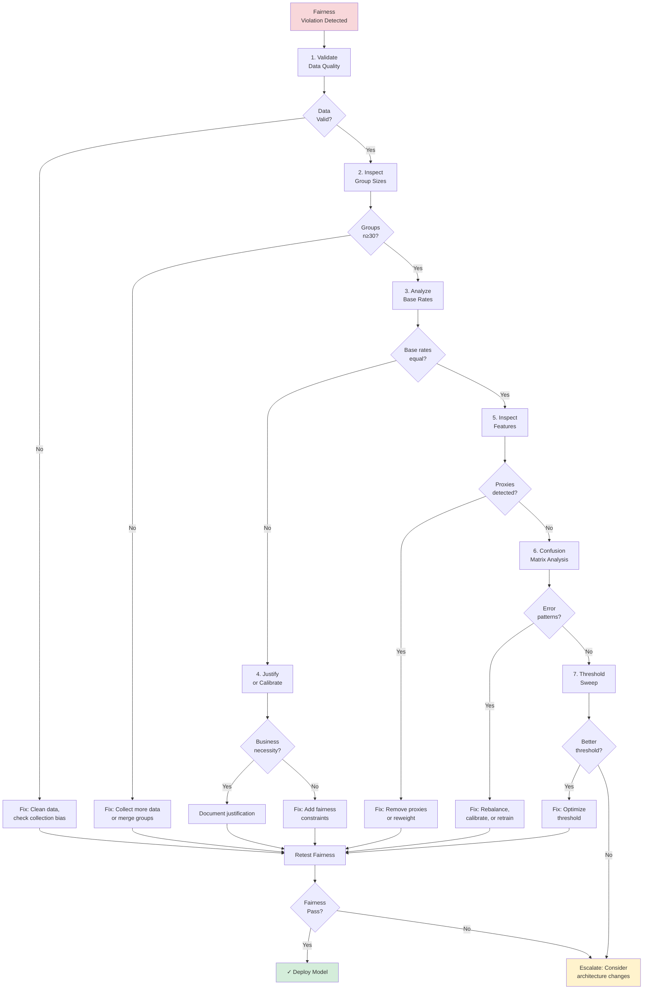

# How to Debug Fairness Violations

Step-by-step troubleshooting guide when your ML model fails fairness tests.

---

## When to use this guide

Use this guide if your GlassAlpha audit shows:

- ❌ **Demographic parity difference > 10%**: Unequal approval/selection rates across groups
- ❌ **Equal opportunity difference > 10%**: Unequal true positive rates
- ❌ **Equalized odds difference > 10%**: Unequal false positive or false negative rates
- ⚠️ **Warning flags** in fairness section of audit report

**Example audit output**:

```yaml
fairness:
  demographic_parity_difference: 0.15 # FAIL (>10%)
  equal_opportunity_difference: 0.18 # FAIL (>10%)
  status: FAIL

  groups:
    male: { selection_rate: 0.50, tpr: 0.85, fpr: 0.05 }
    female: { selection_rate: 0.35, tpr: 0.67, fpr: 0.03 }
```

**Goal**: Diagnose root cause and implement targeted fixes.

---

## Debugging workflow



---

## Step 1: Validate Data Quality

**Why**: Garbage in, garbage out. Biased data yields biased models.

### 1.1: Check for Missing Protected Attributes

```python
# Check missingness by group
missing_analysis = df.groupby('race').apply(
    lambda x: x.isnull().sum() / len(x) * 100
)

print(missing_analysis)
```

**Red flags**:

- Protected attributes missing disproportionately (e.g., 5% missing for White, 30% for Black)
- Key features missing more for one group (e.g., income missing more for women)

**Fix**:

- Impute missing values carefully (avoid introducing bias)
- Drop incomplete records if missingness is random
- Investigate why certain groups have more missing data

### 1.2: Check for Labeling Bias

```python
# Compare label distributions
label_dist = df.groupby('gender')['target'].value_counts(normalize=True)
print(label_dist)

# Check if outcomes reflect historical discrimination
# Example: Arrest data may overrepresent minorities due to biased policing
```

**Red flags**:

- Labels reflect historical discrimination (e.g., arrest rates, loan defaults from redlined areas)
- Subjective labels differ by group (e.g., performance reviews by biased managers)

**Fix**:

- Acknowledge data limitations in audit documentation
- Consider using alternative ground truth (e.g., actual default rates vs credit scores)
- Apply reweighting to correct for selection bias

### 1.3: Check Temporal Consistency

```python
# Check if data collection changed over time
temporal_dist = df.groupby(['year', 'race'])['target'].mean()
temporal_dist.unstack().plot()
```

**Red flags**:

- Sudden shifts in outcomes by group (suggests data collection change)
- One group only appears in recent data (incomplete historical data)

**Fix**:

- Restrict analysis to consistent time periods
- Document data collection changes
- Apply temporal reweighting if justified

---

## Step 2: Inspect Group Sizes

**Why**: Small groups have high variance. A 20% difference with n=5 is noise; with n=500 it's real.

### 2.1: Check Sample Sizes

```python
group_sizes = df.groupby('race').size()
print(group_sizes)

# Check test set sizes (what model is evaluated on)
test_group_sizes = df_test.groupby('race').size()
print(test_group_sizes)
```

**Thresholds**:

- **n ≥ 30**: Minimum for statistical validity
- **n ≥ 100**: Preferred for fairness testing
- **n ≥ 500**: Required for intersectional analysis

**Red flags**:

- Any group < 30 in test set
- Extreme imbalance (e.g., 95% majority, 5% minority)
- Intersectional groups too small (e.g., "Black + Female + Age 65+" = 3 people)

### 2.2: Statistical Significance Test

```python
from scipy.stats import chi2_contingency

# Test if approval rate difference is statistically significant
contingency_table = pd.crosstab(df['race'], df['approved'])
chi2, p_value, dof, expected = chi2_contingency(contingency_table)

print(f"Chi-square: {chi2:.2f}, p-value: {p_value:.4f}")
if p_value < 0.05:
    print("✓ Difference is statistically significant")
else:
    print("⚠️ Difference may be due to chance (small sample)")
```

**Interpretation**:

- **p < 0.05**: Difference is real (not random noise)
- **p ≥ 0.05**: May be sampling variability (collect more data)

### 2.3: Fix Small Groups

**Option A: Collect More Data**

- Targeted sampling from underrepresented groups
- Synthetic data generation (use carefully)

**Option B: Merge Groups**

```python
# Merge small racial categories
df['race_merged'] = df['race'].replace({
    'Native American': 'Other',
    'Pacific Islander': 'Other'
})
```

**Warning**: Merging can hide disparities within merged group.

**Option C: Exclude from Fairness Testing**

```yaml
fairness:
  protected_attributes: ["race", "gender"]
  min_group_size: 30
  # Groups below threshold excluded from fairness metrics
```

---

## Step 3: Analyze Base Rates

**Why**: If groups have different true positive rates in reality, equal outcomes may be unfair.

### 3.1: Calculate Base Rates

```python
base_rates = df.groupby('gender')['creditworthy'].mean()
print(base_rates)

# Example output:
# male      0.65  (65% of men are creditworthy)
# female    0.60  (60% of women are creditworthy)
```

**Question**: If base rates differ, should approval rates differ too?

**Two perspectives**:

1. **Demographic parity**: No, equal access matters more than base rates
2. **Calibration**: Yes, predictions should reflect reality

### 3.2: Check if Base Rate Differences are Real

```python
# Statistical test for base rate difference
from scipy.stats import ttest_ind

male_outcomes = df[df['gender'] == 'male']['creditworthy']
female_outcomes = df[df['gender'] == 'female']['creditworthy']

t_stat, p_value = ttest_ind(male_outcomes, female_outcomes)
print(f"Base rate difference p-value: {p_value:.4f}")
```

**Red flags**:

- Base rate difference is statistically significant (p < 0.05)
- Difference aligns with historical discrimination (e.g., women had less access to credit historically)

### 3.3: Decision Matrix

| Base Rates                  | Action                                                                 |
| --------------------------- | ---------------------------------------------------------------------- |
| **Equal**                   | Enforce demographic parity (equal approval rates)                      |
| **Unequal but explainable** | Document business justification; enforce equal opportunity (equal TPR) |
| **Unequal due to bias**     | Reweight data or apply fairness constraints                            |

**Example**: Disease prevalence genuinely differs by race for genetic conditions → Unequal approval for genetic screening is justified (document clinical basis).

---

## Step 4: Inspect Confusion Matrices by Group

**Why**: Overall accuracy can hide disparate error patterns.

### 4.1: Generate Group-Level Confusion Matrices

```python
from sklearn.metrics import confusion_matrix

for group in df['race'].unique():
    group_data = df[df['race'] == group]
    cm = confusion_matrix(group_data['y_true'], group_data['y_pred'])

    tn, fp, fn, tp = cm.ravel()
    tpr = tp / (tp + fn)  # True positive rate
    fpr = fp / (fp + tn)  # False positive rate

    print(f"\n{group}:")
    print(f"  TPR: {tpr:.3f} (qualified applicants approved)")
    print(f"  FPR: {fpr:.3f} (unqualified applicants approved)")
    print(f"  FNR: {1-tpr:.3f} (qualified applicants denied)")
```

### 4.2: Identify Error Patterns

**Pattern 1: Unequal False Negatives (FN)**

```
Group A: FN = 5%   (95% of qualified approved)
Group B: FN = 20%  (80% of qualified approved)
```

**Problem**: Qualified people in Group B wrongly denied more often.
**Metric violated**: Equal opportunity
**Likely cause**: Model is too conservative for Group B (threshold too high)

**Pattern 2: Unequal False Positives (FP)**

```
Group A: FP = 3%   (3% of unqualified wrongly approved)
Group B: FP = 10%  (10% of unqualified wrongly approved)
```

**Problem**: Unqualified people in Group B wrongly approved more often.
**Metric violated**: Equalized odds (FPR component)
**Likely cause**: Model is too lenient for Group B (threshold too low)

**Pattern 3: Opposite Errors**

```
Group A: FN = 10%, FP = 2%  (too conservative)
Group B: FN = 2%, FP = 10%  (too lenient)
```

**Problem**: Same overall error rate but opposite error types.
**Metric violated**: Equalized odds
**Likely cause**: Model uses different decision boundaries by group (proxies)

### 4.3: Visualize Errors

```python
import matplotlib.pyplot as plt

groups = df['gender'].unique()
tpr_vals = [...]  # Calculate TPR for each group
fpr_vals = [...]  # Calculate FPR for each group

fig, ax = plt.subplots(figsize=(8, 6))
ax.scatter(fpr_vals, tpr_vals, s=100)

for i, group in enumerate(groups):
    ax.annotate(group, (fpr_vals[i], fpr_vals[i]))

ax.set_xlabel('False Positive Rate')
ax.set_ylabel('True Positive Rate')
ax.set_title('Error Rates by Group')
ax.plot([0, 1], [0, 1], 'k--', alpha=0.3)
plt.show()
```

**Goal**: Points should cluster (similar error rates). If scattered, groups are treated differently.

---

## Step 5: Detect Proxy Variables

**Why**: Even without explicit race/gender, models can learn to discriminate through correlated features.

### 5.1: Correlation Analysis

```python
# Correlation between features and protected attributes
correlations = df.corr()['race'].sort_values(ascending=False)
print(correlations)

# Example output:
# zip_code       0.78  ← Strong proxy
# education      0.42  ← Moderate proxy
# income         0.31  ← Weak proxy
```

**Thresholds**:

- **|r| > 0.7**: Strong proxy (high risk)
- **|r| = 0.4-0.7**: Moderate proxy (investigate)
- **|r| < 0.4**: Weak correlation (acceptable)

### 5.2: Feature Importance by Group

```python
# Check if model relies on different features by group
for group in df['race'].unique():
    group_data = df[df['race'] == group]
    feature_importance = model.feature_importances_  # For tree models
    print(f"\n{group}: Top features:")
    print(feature_importance.sort_values(ascending=False).head(5))
```

**Red flag**: Model uses different features for different groups (suggests proxy usage).

### 5.3: Remove or Mitigate Proxies

**Option A: Remove High-Correlation Features**

```python
# Drop features with correlation > 0.7
high_corr_features = correlations[abs(correlations) > 0.7].index
X_train_clean = X_train.drop(columns=high_corr_features)
```

**Pros**: Simple, removes direct proxy
**Cons**: May reduce accuracy; other features can still proxy

**Option B: Adversarial Debiasing**

```python
from fairlearn.adversarial import AdversarialFairnessClassifier

# Train model to maximize accuracy while minimizing ability to predict protected attribute
mitigator = AdversarialFairnessClassifier(
    predictor_model=base_model,
    adversary_model=adversary_model
)
mitigator.fit(X_train, y_train, sensitive_features=protected_attrs)
```

**Pros**: Reduces proxy reliance systematically
**Cons**: Requires tuning, may reduce accuracy significantly

---

## Step 6: Threshold Sweep Analysis

**Why**: A single threshold may not be optimal for fairness. Different thresholds can satisfy different fairness metrics.

### 6.1: Generate Threshold Sweep

```python
thresholds = np.linspace(0.1, 0.9, 50)
results = []

for threshold in thresholds:
    y_pred = (model.predict_proba(X_test)[:, 1] >= threshold).astype(int)

    for group in protected_groups:
        mask = (test_protected_attrs == group)
        tpr = recall_score(y_test[mask], y_pred[mask])
        fpr = false_positive_rate(y_test[mask], y_pred[mask])
        selection_rate = y_pred[mask].mean()

        results.append({
            'threshold': threshold,
            'group': group,
            'tpr': tpr,
            'fpr': fpr,
            'selection_rate': selection_rate
        })

df_sweep = pd.DataFrame(results)
```

### 6.2: Visualize Fairness Metrics Across Thresholds

```python
import matplotlib.pyplot as plt

fig, axes = plt.subplots(1, 3, figsize=(18, 5))

# Demographic parity
for group in protected_groups:
    group_data = df_sweep[df_sweep['group'] == group]
    axes[0].plot(group_data['threshold'], group_data['selection_rate'], label=group)
axes[0].set_title('Demographic Parity (Selection Rate)')
axes[0].set_xlabel('Threshold')
axes[0].set_ylabel('Selection Rate')
axes[0].legend()

# Equal opportunity (TPR)
for group in protected_groups:
    group_data = df_sweep[df_sweep['group'] == group]
    axes[1].plot(group_data['threshold'], group_data['tpr'], label=group)
axes[1].set_title('Equal Opportunity (TPR)')
axes[1].set_xlabel('Threshold')
axes[1].set_ylabel('True Positive Rate')
axes[1].legend()

# Equalized odds (FPR)
for group in protected_groups:
    group_data = df_sweep[df_sweep['group'] == group]
    axes[2].plot(group_data['threshold'], group_data['fpr'], label=group)
axes[2].set_title('Equalized Odds (FPR)')
axes[2].set_xlabel('Threshold')
axes[2].set_ylabel('False Positive Rate')
axes[2].legend()

plt.tight_layout()
plt.show()
```

### 6.3: Find Optimal Threshold

```python
# Find threshold that minimizes fairness disparity
def disparity(threshold, metric='tpr'):
    subset = df_sweep[df_sweep['threshold'] == threshold]
    values = subset[metric].values
    return max(values) - min(values)

# Minimize disparity for equal opportunity
optimal_threshold = min(thresholds, key=lambda t: disparity(t, metric='tpr'))
print(f"Optimal threshold for equal opportunity: {optimal_threshold:.3f}")

# Check accuracy trade-off
base_acc = accuracy_score(y_test, y_pred_base)
optimal_y_pred = (model.predict_proba(X_test)[:, 1] >= optimal_threshold).astype(int)
optimal_acc = accuracy_score(y_test, optimal_y_pred)

print(f"Accuracy at base threshold (0.5): {base_acc:.3f}")
print(f"Accuracy at optimal threshold ({optimal_threshold:.3f}): {optimal_acc:.3f}")
print(f"Accuracy cost: {base_acc - optimal_acc:.3f}")
```

**Decision criteria**:

- **< 2% accuracy loss**: Accept optimal threshold
- **2-5% accuracy loss**: Review with stakeholders
- **> 5% accuracy loss**: Consider group-specific thresholds or model retraining

---

## Step 7: Apply Fairness Constraints

If threshold tuning isn't enough, retrain with fairness constraints:

### 7.1: Fairlearn Reductions

```python
from fairlearn.reductions import DemographicParity, ExponentiatedGradient

# Constraint: Demographic parity
constraint = DemographicParity()

# Mitigator: Reweight training examples to satisfy constraint
mitigator = ExponentiatedGradient(
    estimator=base_model,
    constraints=constraint
)

mitigator.fit(X_train, y_train, sensitive_features=train_protected_attrs)

# Evaluate fairness
y_pred_fair = mitigator.predict(X_test)
```

**Pros**: Guarantees fairness constraint satisfaction (within tolerance)
**Cons**: Accuracy reduction (typically 2-5%)

### 7.2: Post-Processing Calibration

```python
from fairlearn.postprocessing import ThresholdOptimizer

# Optimize thresholds per group to satisfy fairness constraint
postprocessor = ThresholdOptimizer(
    estimator=base_model,
    constraints='demographic_parity',  # or 'equalized_odds'
    objective='accuracy_score'
)

postprocessor.fit(X_train, y_train, sensitive_features=train_protected_attrs)

# Apply group-specific thresholds
y_pred_fair = postprocessor.predict(X_test, sensitive_features=test_protected_attrs)
```

**Pros**: No retraining needed; can optimize multiple metrics
**Cons**: Requires protected attributes at inference time (may not be acceptable)

### 7.3: GlassAlpha Policy Gates

```yaml
# configs/fairness_policy.yaml
policy_gates:
  fairness:
    demographic_parity:
      threshold: 0.10
      action: FAIL
      remediation: "Apply fairness constraints or threshold optimization"

    equal_opportunity:
      threshold: 0.10
      action: FAIL
      remediation: "Recalibrate or retrain with equalized odds constraint"
```

Run audit with policy:

```bash
glassalpha audit --config audit.yaml --policy fairness_policy.yaml
```

---

## Step 8: Document and Justify

If fairness violations persist despite mitigation:

### 8.1: Business Necessity Justification

```yaml
fairness_justification:
  metric_violated: equal_opportunity_difference
  value: 0.12
  threshold: 0.10

  business_necessity:
    claim: "Base rates genuinely differ due to differential risk factors"
    evidence:
      - "Actuarial analysis shows 15% difference in default rates by gender"
      - "Historical data (5 years) confirms consistent pattern"
      - "Independent audit verified risk-based pricing is accurate"

  alternative_methods_considered:
    - method: "Demographic parity constraint"
      accuracy_loss: 0.08
      fairness_improvement: 0.03
      rejected_reason: "Excessive accuracy loss harms creditworthy applicants"

    - method: "Group-specific thresholds"
      accuracy_loss: 0.02
      fairness_improvement: 0.06
      adopted: true
```

### 8.2: Residual Risk Assessment

```yaml
residual_risk:
  disparate_impact: 0.08 # After mitigation
  litigation_risk: MEDIUM
  regulatory_risk: LOW
  reputational_risk: MEDIUM

  mitigation_plan:
    - "Quarterly fairness audits"
    - "Ongoing monitoring for drift"
    - "Annual independent validation"
    - "Publish transparency report"
```

---

## Common scenarios and fixes

### Scenario 1: High Demographic Parity Violation, Equal Opportunity OK

```yaml
demographic_parity_difference: 0.18 # FAIL
equal_opportunity_difference: 0.04 # PASS
```

**Diagnosis**: Approval rates differ but qualified applicants treated equally.

**Likely cause**: Base rates differ by group.

**Fix**:

1. Check if base rate difference is real and justified
2. If yes: Document business necessity, focus on equal opportunity
3. If no: Apply demographic parity constraint

### Scenario 2: Equal Opportunity Violation, Demographic Parity OK

```yaml
demographic_parity_difference: 0.06 # PASS
equal_opportunity_difference: 0.15 # FAIL
```

**Diagnosis**: Approval rates equal but qualified applicants in one group denied more often.

**Likely cause**: Threshold too high for one group (conservative bias).

**Fix**:

1. Threshold sweep to find better balance
2. Check for proxy variables (features correlated with protected attribute)
3. Apply equal opportunity constraint during training

### Scenario 3: Both Metrics Fail

```yaml
demographic_parity_difference: 0.14 # FAIL
equal_opportunity_difference: 0.16 # FAIL
equalized_odds_difference: 0.18 # FAIL
```

**Diagnosis**: Systematic bias across all metrics.

**Likely cause**: Proxies, biased training data, or discriminatory features.

**Fix**:

1. Comprehensive proxy detection and removal
2. Retrain with fairness constraints (equalized odds)
3. Consider collecting more balanced training data
4. If all fail: Escalate for architecture review

### Scenario 4: Intersectional Violations

```yaml
# Single-attribute analysis: PASS
gender: { demographic_parity: 0.05 }
race: { demographic_parity: 0.06 }

# Intersectional analysis: FAIL
gender=female & race=black: { demographic_parity: 0.22 }
```

**Diagnosis**: Bias hidden at intersections.

**Likely cause**: Compound discrimination (double disadvantage).

**Fix**:

1. Report intersectional metrics separately
2. Collect more data for small intersectional groups
3. Apply intersectional fairness constraints
4. Consider group-specific models or thresholds

---

## When to escalate

Escalate to senior stakeholders if:

- ✅ **All mitigation attempts fail** (disparity remains >10% despite retraining)
- ✅ **Accuracy cost exceeds 10%** (fairness constraint destroys model utility)
- ✅ **Business justification unclear** (can't articulate why disparity is acceptable)
- ✅ **Litigation risk high** (historical discrimination in this domain)
- ✅ **Protected attribute is legally prohibited** (e.g., race in credit scoring)

**Escalation memo template**:

```
Subject: Fairness Violation - Credit Model v2.3

Summary: Model fails equal opportunity test (18% disparity in TPR by race)

Mitigation Attempts:
1. Threshold optimization: Reduced disparity to 14% (cost: 3% accuracy)
2. Proxy removal: Reduced disparity to 16% (cost: 2% accuracy)
3. Fairness constraint: Reduced disparity to 11% (cost: 9% accuracy)

Residual Risk:
- Disparity: 11% (exceeds 10% tolerance)
- Litigation risk: HIGH (historical ECOA violations in this product line)
- Regulatory risk: MEDIUM (CFPB focus on credit disparities)

Options:
A. Accept 11% disparity with business justification (requires legal review)
B. Accept 9% accuracy loss to hit 10% tolerance (impacts profitability)
C. Delay deployment pending data collection for underrepresented groups

Recommendation: Option B (accept accuracy cost for compliance)
```

---

## Checklist: Fairness Debugging

Use this checklist systematically:

### Data quality

- [ ] Checked for missing values by group
- [ ] Verified labels aren't biased (historical discrimination)
- [ ] Confirmed temporal consistency
- [ ] Documented data limitations

### Statistical validity

- [ ] All groups have n ≥ 30 in test set
- [ ] Disparity is statistically significant (not sampling noise)
- [ ] Base rates calculated and justified

### Model analysis

- [ ] Generated confusion matrices by group
- [ ] Identified error patterns (FN vs FP)
- [ ] Ran proxy detection (correlation >0.7)
- [ ] Checked feature importance by group

### Mitigation

- [ ] Performed threshold sweep
- [ ] Identified optimal threshold (if exists)
- [ ] Applied fairness constraints (if needed)
- [ ] Tested intersectional fairness

### Documentation

- [ ] Documented root cause
- [ ] Justified residual disparity (if any)
- [ ] Assessed litigation/regulatory risk
- [ ] Created monitoring plan

### Deployment

- [ ] Reran full audit with fixes
- [ ] Verified all gates pass
- [ ] Generated evidence pack
- [ ] Obtained sign-off from compliance

---

## Next steps

### Learn more

- [Fairness 101](../fairness-101.md) - Understanding fairness metrics
- [Understanding Protected Attributes](../understanding-protected-attributes.md) - Legal framework
- [Fairness Metrics Reference](../../reference/fairness-metrics.md) - Technical definitions and individual fairness

### Tools

- [Fairlearn Documentation](https://fairlearn.org/) - Fairness constraint libraries
- [AI Fairness 360](https://aif360.mybluemix.net/) - IBM fairness toolkit
- [What-If Tool](https://pair-code.github.io/what-if-tool/) - Visual debugging

### Compliance

- [Banking Guide (SR 11-7)](../../compliance/banking-guide.md) - Credit fairness requirements
- [Insurance Guide (NAIC #870)](../../compliance/insurance-guide.md) - Underwriting fairness
- [Employment Guide](../../compliance/fraud-guide.md) - Hiring fairness (Title VII)

---

**Questions?** [Join our community](https://github.com/glassalpha/glassalpha/discussions) or [contact us](../../contact.md).
