# Understanding Protected Attributes

A comprehensive guide to identifying, handling, and documenting protected attributes in ML systems for regulatory compliance.

---

## What are protected attributes?

**Protected attributes** (also called protected classes, sensitive attributes, or fairness-sensitive features) are personal characteristics that:

1. **Are legally protected** from discrimination (race, gender, age, disability)
2. **Are immutable or fundamental** to personal identity
3. **Have been historically used to discriminate** against specific groups

**Examples**: Race, gender, age, national origin, religion, disability status, pregnancy status, genetic information, veteran status.

**Why they matter**: Using these attributes to make decisions (loans, hiring, healthcare) can violate civil rights laws and perpetuate systemic discrimination.

---

## Legal framework by jurisdiction

### United states

Protected classes are defined by multiple federal laws:

| Law                                                  | Protected Classes                                                                           | Applies To                           |
| ---------------------------------------------------- | ------------------------------------------------------------------------------------------- | ------------------------------------ |
| **Equal Credit Opportunity Act (ECOA)**              | Race, color, religion, national origin, sex, marital status, age, public assistance receipt | Credit decisions (loans, cards)      |
| **Fair Credit Reporting Act (FCRA)**                 | All ECOA classes + more                                                                     | Adverse actions using credit reports |
| **Title VII (Civil Rights Act)**                     | Race, color, religion, sex, national origin                                                 | Employment decisions                 |
| **Age Discrimination in Employment Act**             | Age 40+                                                                                     | Employment for older workers         |
| **Americans with Disabilities Act (ADA)**            | Disability status                                                                           | Employment, public accommodations    |
| **Fair Housing Act**                                 | Race, color, religion, national origin, sex, familial status, disability                    | Housing, lending                     |
| **Genetic Information Nondiscrimination Act (GINA)** | Genetic information                                                                         | Employment, health insurance         |
| **Pregnancy Discrimination Act**                     | Pregnancy, childbirth, related conditions                                                   | Employment                           |

**State laws may add more**: California adds sexual orientation and gender identity; Massachusetts adds ancestry; New York adds marital status.

### European union

**GDPR Article 9** defines "special categories of personal data" (more stringent than US):

- Racial or ethnic origin
- Political opinions
- Religious or philosophical beliefs
- Trade union membership
- Genetic data
- Biometric data (for identification)
- Health data
- Sex life or sexual orientation

**Processing special categories requires explicit consent or legal basis** (Article 9(2)).

**EU AI Act** adds requirements:

- High-risk systems must test for bias on protected groups
- Fundamental rights impact assessments required
- Documentation of data governance for protected attributes

### Other jurisdictions

**United Kingdom (Equality Act 2010)**:

- Age, disability, gender reassignment, marriage/civil partnership, pregnancy/maternity, race, religion/belief, sex, sexual orientation

**Canada (Canadian Human Rights Act)**:

- Race, national/ethnic origin, color, religion, age, sex, sexual orientation, gender identity/expression, marital status, family status, genetic characteristics, disability, conviction for pardoned offense

**Australia (Age Discrimination Act, Racial Discrimination Act, etc.)**:

- Race, color, national/ethnic origin, sex, age, disability, marital status, sexual orientation, gender identity, intersex status

---

## Why can't we just remove protected attributes?

**The naive approach**: "Let's just not use race/gender in our model."

**Why this fails**: Even without explicit protected attributes, models can learn to discriminate through **proxy variables**.

### Example: Credit Scoring Without Explicit Race

```python
# Features (no explicit race)
features = [
    'income',
    'zip_code',      # ← Proxy for race (redlining)
    'first_name',    # ← Proxy for gender/ethnicity
    'education',     # ← Correlated with race due to systemic barriers
    'employment_length'
]

# Model learns: zip_code='07302' → high risk
# Reality: 07302 is a historically Black neighborhood
# Result: Disparate impact without using race explicitly
```

**The problem**: U.S. demographic segregation means seemingly neutral features encode protected attributes.

**The solution**:

1. **Detect proxies** using correlation analysis
2. **Measure fairness** even when protected attributes aren't model inputs
3. **Test for disparate impact** on held-out protected attributes

---

## How to identify protected attributes

Use this decision tree:

```mermaid
graph TD
    Start[Is this attribute<br/>protected?] --> Legal{Explicitly listed<br/>in law?}

    Legal -->|Yes| Protected[✅ PROTECTED<br/>Must track for fairness]
    Legal -->|No| Historical{Used historically<br/>to discriminate?}

    Historical -->|Yes| Evaluate{Context-dependent<br/>evaluation needed}
    Historical -->|No| Immutable{Immutable or<br/>fundamental identity?}

    Immutable -->|Yes| Evaluate
    Immutable -->|No| Proxy{High correlation<br/>with protected class?}

    Proxy -->|Yes| ProxyVar[⚠️ PROXY VARIABLE<br/>Test for disparate impact]
    Proxy -->|No| Safe[✅ NOT PROTECTED<br/>Standard treatment]

    Evaluate --> Domain{Domain-specific<br/>assessment}
    Domain -->|High risk| Protected
    Domain -->|Medium risk| ProxyVar
    Domain -->|Low risk| Safe

    style Protected fill:#f8d7da
    style ProxyVar fill:#fff3cd
    style Safe fill:#d4edda
```



### Examples by category

#### ✅ Always Protected (US)

- **Race/Ethnicity**: African American, Hispanic, Asian, Native American, White
- **Gender/Sex**: Male, Female, Non-binary, Transgender status
- **Age**: Especially 40+ (ADEA), but all ages in some contexts (ECOA)
- **Disability**: Physical, mental, learning disabilities
- **National Origin**: Country of birth, citizenship status (in some contexts)
- **Religion**: Any religious belief or non-belief

#### ⚠️ Context-Dependent

- **Marital Status**: Protected in credit (ECOA) but not always in employment
- **Zip Code**: Not legally protected but strong race/income proxy
- **Education Level**: Not protected but correlated with race/class
- **English Proficiency**: Can be proxy for national origin
- **Military Service**: Protected for veterans in employment (USERRA)

#### 🔍 Industry-Specific

- **Health Insurance**: Pre-existing conditions (ACA), genetic info (GINA)
- **Housing**: Familial status (Fair Housing Act), source of income (state laws)
- **Employment**: Unemployment status (NYC, DC), caregiver status (FMLA)
- **Credit**: Public assistance receipt (ECOA)

#### ❌ Generally Not Protected (but check local laws)

- **Income Level**: Not protected (but correlated with race)
- **Credit Score**: Not protected (but used in regulated decisions)
- **Employment History**: Not protected (but can have disparate impact)
- **Homeownership**: Not protected (but correlated with wealth/race)

---

## Common proxy variables

These seemingly neutral features often encode protected attributes:

### Geographic proxies

- **Zip Code**: Highly correlated with race due to residential segregation
- **City/County**: Similar to zip code
- **Census Tract**: Even more granular race proxy
- **School District**: Correlated with race and income

**Example**: In Chicago, knowing someone's zip code predicts their race with 80%+ accuracy.

### Name-Based Proxies

- **First Name**: Encodes gender and ethnicity (e.g., "Jamal" vs "Brad")
- **Last Name**: Encodes national origin and ethnicity
- **Name Length**: Correlates with ethnicity in some datasets
- **Middle Name**: Can indicate cultural background

**Example**: Resume study found identical resumes with "Black-sounding" names received 50% fewer callbacks.

### Socioeconomic proxies

- **Education Level**: Correlated with race due to systemic barriers
- **Employment Type**: Blue-collar vs white-collar correlates with race/gender
- **Income**: Correlated with race and gender (pay gap)
- **Homeownership**: Correlated with race (wealth gap from redlining)

### Behavioral proxies

- **Shopping Patterns**: Correlated with income and culture
- **Communication Style**: Language formality can correlate with education/class
- **Device Type**: iPhone vs Android correlates with income
- **Time of Application**: Shift work correlates with occupation and race

### Healthcare proxies

- **ZIP Code + Diagnosis**: Can reveal race-specific conditions
- **Primary Language**: Proxy for national origin
- **Payment Type**: Medicaid enrollment correlates with income/race
- **Hospital System**: Access patterns differ by race/geography

---

## Should you include protected attributes in your model?

**The debate**:

- **Fairness through unawareness**: Remove protected attributes to avoid explicit discrimination
- **Fairness through awareness**: Include protected attributes to detect and mitigate bias

### When to exclude from model inputs

✅ **Situations**:

1. **Legal prohibition**: Some laws ban use (e.g., race in credit scoring)
2. **No valid business use**: Attribute is irrelevant to outcome
3. **High litigation risk**: Including attribute invites discrimination claims
4. **Simple model**: Fewer features reduce proxy risk

❌ **Risks**:

- Proxies can encode protected attributes anyway
- Harder to detect and mitigate bias
- May violate "fairness through awareness" best practices

**Example**: ECOA prohibits considering race in credit decisions, so it's excluded from model inputs. However, you still must test for disparate impact.

### When to include for fairness testing

✅ **Situations**:

1. **Disparate impact testing**: Required to measure group-level fairness
2. **Bias mitigation**: Needed to apply fairness constraints
3. **Explainability**: Generate counterfactuals ("Would outcome differ if race changed?")
4. **Audit requirements**: Regulators expect fairness analysis by protected class

✅ **How to do it safely**:

1. Use protected attributes ONLY for evaluation, not prediction
2. Split data: Model sees features only, evaluator sees features + protected attributes
3. Document that protected attributes are excluded from prediction pipeline
4. Generate separate dataset with protected attributes for testing

**Example**: Train credit model on income, debt, history (no race). Then evaluate predictions by race using separate demographic data.

---

## How GlassAlpha handles protected attributes

### 1. Separate Evaluation Dataset

```python
# Model training (no protected attributes)
model.fit(X_train[['income', 'debt', 'credit_history']], y_train)

# Fairness evaluation (with protected attributes)
result = glassalpha.audit.from_model(
    model=model,
    X_test=X_test[['income', 'debt', 'credit_history']],  # No protected attrs
    y_test=y_test,
    protected_attributes=['race', 'gender'],  # Evaluation only
    random_seed=42
)
```

**Key**: Model never sees protected attributes during training or prediction. They're used ONLY to stratify evaluation metrics.

### 2. Documentation in Manifest

```yaml
audit_manifest:
  model:
    features_used: ["income", "debt", "credit_history"]
    protected_attributes_in_training: false

  fairness_evaluation:
    protected_attributes: ["race", "gender", "age_group"]
    purpose: "Disparate impact testing (ECOA compliance)"
    attributes_source: "Separate demographics table (not model input)"
```

### 3. Proxy Detection

```python
# GlassAlpha can detect proxies
result.proxy_detection
# Output:
# {
#   'zip_code': {'race_correlation': 0.78, 'risk': 'HIGH'},
#   'first_name': {'gender_correlation': 0.91, 'risk': 'HIGH'},
#   'education': {'race_correlation': 0.42, 'risk': 'MEDIUM'}
# }
```

---

## Data collection best practices

### 1. Voluntary Self-Identification

**Approach**: Ask applicants to voluntarily provide protected attributes for monitoring purposes.

**Example (Credit Application)**:

```
┌─────────────────────────────────────────────────────┐
│ Optional: Demographic Information                   │
│                                                      │
│ We collect this information to monitor compliance   │
│ with equal credit opportunity laws. Providing this  │
│ information is voluntary and will not affect your   │
│ application decision.                               │
│                                                      │
│ Ethnicity: [ ] Hispanic/Latino [ ] Not Hispanic    │
│ Race: [ ] White [ ] Black [ ] Asian [ ] Other      │
│ Gender: [ ] Male [ ] Female [ ] Prefer not to say  │
│                                                      │
│ [✓] I understand this is optional                   │
└─────────────────────────────────────────────────────┘
```

**Pros**:

- Complies with ECOA "information for monitoring purposes" exception
- Respects applicant choice
- Clear separation from decision-making

**Cons**:

- Missing data (many decline to provide)
- Selection bias (who provides may differ from who doesn't)

### 2. Imputation from Public Records

**Approach**: Use name-based or geography-based imputation.

**Example**: Bayesian Improved Surname Geocoding (BISG) estimates race probability from last name + zip code.

**Pros**:

- No missing data
- Can analyze historical decisions where demographics weren't collected

**Cons**:

- Imputation errors (stereotyping risk)
- Less accurate for mixed-race individuals
- Ethically questionable (assigning race without consent)

**Regulatory view**:

- **CFPB allows BISG** for fair lending monitoring (but not for decisions)
- **EEOC skeptical** of imputation for employment testing

### 3. Synthetic Data for Testing

**Approach**: Create synthetic examples spanning protected groups for stress testing.

**Example**:

```python
# Generate synthetic test cases
synthetic_data = create_test_cases(
    base_applicant={'income': 50000, 'debt': 10000},
    vary=['race', 'gender', 'age'],
    n_samples=1000
)

# Test model for differential treatment
results = test_consistency(model, synthetic_data)
```

**Pros**:

- No privacy concerns (no real PII)
- Complete coverage of protected groups
- Useful for "similarly situated" testing

**Cons**:

- Doesn't reflect real data distribution
- May miss real-world proxy effects

---

## Compliance requirements by use case

### Credit/Lending (ECOA, FCRA)

**Requirements**:

- ❌ **Cannot use** race, color, religion, national origin, sex, marital status, age (except to verify capacity to contract), public assistance receipt for credit decisions
- ✅ **Must collect** race, ethnicity, sex for monitoring purposes (Home Mortgage Disclosure Act)
- ✅ **Must test** for disparate impact even if attributes not used in model

**GlassAlpha config**:

```yaml
model:
  protected_attributes_in_training: false # ECOA prohibition

fairness:
  test_disparate_impact: true
  protected_attributes: ["race", "gender", "age_group"]
  source: "voluntary_self_id"
  threshold: 0.10 # CFPB expects <10% disparity
```

### Employment (Title VII, ADEA, ADA)

**Requirements**:

- ❌ **Cannot use** race, color, religion, sex, national origin, age 40+, disability for hiring/promotion unless bona fide occupational qualification (BFOQ)
- ✅ **Must test** for adverse impact (EEOC's 80% rule)
- ✅ **May collect** for affirmative action purposes (but keep separate from decisions)

**GlassAlpha config**:

```yaml
fairness:
  test_adverse_impact: true
  threshold: 0.20 # EEOC 80% rule (20% relative difference)
  four_fifths_rule: true
```

### Insurance (NAIC Model #870, State Laws)

**Requirements**:

- ❌ **Cannot use** race (all states), gender (some states), genetic information (GINA)
- ⚠️ **Can use with justification**: age, location, credit score (varies by state)
- ✅ **Must document** actuarial justification for any disparate impact

**GlassAlpha config**:

```yaml
fairness:
  protected_attributes: ["race", "gender", "age_group"]
  require_actuarial_justification: true
  document_business_necessity: true
```

### Healthcare (HIPAA, Cures Act)

**Requirements**:

- ⚠️ **May use** race, ethnicity, gender for clinical relevance (e.g., disease prevalence)
- ✅ **Must document** clinical justification
- ✅ **Must test** for performance disparities across protected groups

**GlassAlpha config**:

```yaml
model:
  protected_attributes_in_training: true # Clinical relevance exception
  clinical_justification: "Risk scores adjusted for race-specific disease prevalence"

fairness:
  test_equalized_odds: true # Equal diagnostic accuracy
  threshold: 0.05
```

---

## Documentation requirements

Every audit must document protected attribute handling:

### 1. Attribute Inventory

```yaml
protected_attributes:
  collected:
    - name: race
      categories:
        ["White", "Black", "Hispanic", "Asian", "Native American", "Other"]
      collection_method: "voluntary_self_identification"
      legal_basis: "HMDA monitoring requirement"

    - name: gender
      categories: ["Male", "Female", "Non-binary", "Prefer not to say"]
      collection_method: "voluntary_self_identification"
      legal_basis: "ECOA monitoring requirement"

  proxies_detected:
    - feature: zip_code
      correlation_with: race
      correlation_strength: 0.78
      mitigation: "Removed from model inputs"
```

### 2. Usage Policy

```yaml
protected_attribute_policy:
  model_training:
    attributes_used: [] # None used in training
    justification: "ECOA prohibition on using race/gender in credit decisions"

  model_evaluation:
    attributes_used: ["race", "gender", "age_group"]
    purpose: "Disparate impact testing (ECOA Section 1002.4)"
    threshold: 0.10
    action_if_violated: "Reject model; investigate and remediate"

  data_governance:
    access_controls: "Protected attributes stored separately from training data"
    retention: "7 years (FCRA requirement)"
    deletion: "Automated deletion after retention period"
```

### 3. Testing Results

```yaml
fairness_tests:
  race:
    demographic_parity: 0.08 # Within 10% tolerance
    equal_opportunity: 0.12 # FAIL: Exceeds threshold
    action: "Model rejected; requires recalibration"

  gender:
    demographic_parity: 0.05 # PASS
    equal_opportunity: 0.06 # PASS
    action: "Model approved for production"
```

---

## Common mistakes

### 1. ❌ "We don't collect race, so we're compliant"

**Wrong**: Absence of explicit race doesn't prevent proxy discrimination.

**Fix**: Collect protected attributes for testing purposes (separate from model inputs).

### 2. ❌ "We balance training data by race"

**Wrong**: Balanced training doesn't guarantee fair predictions.

**Fix**: Measure fairness on test set predictions, not training set composition.

### 3. ❌ "We have a disclaimer that we don't discriminate"

**Wrong**: Disparate impact liability doesn't require intent.

**Fix**: Test outcomes empirically; disclaimers don't protect from disparate impact claims.

### 4. ❌ "We removed zip code to avoid proxy bias"

**Wrong**: Many other features can serve as proxies.

**Fix**: Systematically test for proxies using correlation analysis.

### 5. ❌ "We use race to improve accuracy for minorities"

**Wrong**: Including race as a feature (even with good intent) can violate anti-discrimination laws.

**Fix**: Use fairness constraints (e.g., demographic parity) instead of race as a direct input.

---

## Checklist: Protected Attribute Compliance

Use this checklist for every ML system:

### Data collection

- [ ] Identified all protected attributes relevant to jurisdiction and industry
- [ ] Documented collection method (voluntary, imputed, synthetic)
- [ ] Obtained legal sign-off on collection and use
- [ ] Implemented access controls (separate from model training data)

### Model development

- [ ] Excluded legally prohibited attributes from model inputs
- [ ] Tested for proxy variables using correlation analysis
- [ ] Documented business justification for any correlated features used
- [ ] Applied fairness constraints during training (if appropriate)

### Evaluation

- [ ] Tested disparate impact on all protected groups
- [ ] Reported group-level metrics (demographic parity, equal opportunity, equalized odds)
- [ ] Checked intersectional fairness (combinations of attributes)
- [ ] Generated evidence pack with fairness analysis

### Documentation

- [ ] Attribute inventory (what's collected, why, how)
- [ ] Usage policy (training vs evaluation)
- [ ] Proxy detection results
- [ ] Fairness test results with thresholds
- [ ] Mitigation actions taken (if violations found)
- [ ] Legal review sign-off

### Governance

- [ ] Retention policy defined (typically 7 years for credit)
- [ ] Deletion process automated
- [ ] Audit trail of who accessed protected attributes
- [ ] Incident response plan if discrimination alleged

---

## Next steps

### Learn more

- [Fairness 101](fairness-101.md) - Which fairness metrics to use
- [Debug Fairness Violations](how-to/debug-fairness-violations.md) - Troubleshooting bias
- [Fairness Metrics Reference](../reference/fairness-metrics.md) - Technical methods and individual fairness

### Try it yourself

- [Quickstart Guide](../getting-started/quickstart.md) - Run your first fairness audit
- [Configuration Patterns](../getting-started/configuration-patterns.md) - Industry-specific configs

### Compliance guides

- [Banking (SR 11-7, ECOA, FCRA)](../compliance/banking-guide.md)
- [Insurance (NAIC Model #870)](../compliance/insurance-guide.md)
- [Healthcare (HIPAA, Cures Act)](../compliance/healthcare-guide.md)
- [Employment (Title VII, ADEA)](../compliance/fraud-guide.md)

---

**Questions?** [Join our community](https://github.com/glassalpha/glassalpha/discussions) or [contact us](../contact.md).
