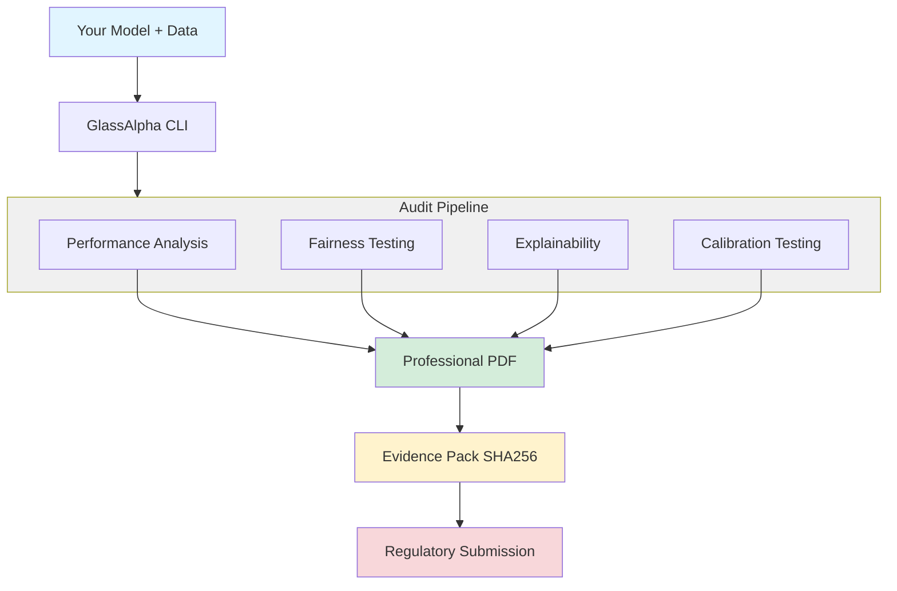

---
hide:
  - navigation
---

# GlassAlpha

GlassAlpha makes **deterministic, regulator-ready PDF audit reports** for tabular ML models. It's an open-source ([Apache 2.0](reference/trust-deployment.md#licensing-dependencies)) toolkit for reproducible, audit-ready model documentation.

_Note: GlassAlpha is currently pre-alpha while I'm still making significant changes. I'll cut the first official release and publish it on PyPI once things stabilize. The audits do run and the package works, so feel free to try it out, feedback welcome!_

## How it works

**Single command**: `glassalpha audit --config your_config.yaml --output audit.pdf`

<div class="index-hero-diagram" markdown>



</div>

## Quick links

- [**Quick start guide**](getting-started/quickstart.md): Run an audit in 60 seconds
- [**Interactive notebook**](https://colab.research.google.com/github/GlassAlpha/glassalpha/blob/main/examples/notebooks/quickstart_colab.ipynb): Try in Colab (zero setup)
- [**Python API reference**](reference/api/index.md): `from_model()` API for notebooks and programmatic use
- [**Feature overview**](getting-started/overview.md): Why choose GlassAlpha and how it compares
- [**Using your own data**](getting-started/custom-data.md): Audit your models with custom CSV files
- [**Examples**](examples/german-credit-audit.md): Walkthrough ML audits on credit, healthcare bias and fraud detection

## Run your first audit in 60 seconds

```bash
# 1. Install with pipx (30 seconds)
pipx install glassalpha

# 2. Generate audit (lightning fast!)
glassalpha audit --config packages/configs/german_credit_simple.yaml --output audit.html --fast

# 3. Done! Open your professional report (~2-3 seconds total)
open audit.html  # macOS
# xdg-open audit.html  # Linux
# start audit.html  # Windows
```

**Or install from source:**

```bash
git clone https://github.com/GlassAlpha/glassalpha
cd glassalpha/packages && pip install -e .
glassalpha audit --config configs/german_credit_simple.yaml --output audit.html --fast
```

**Result**: A professional audit report with model performance, fairness analysis, feature importance, individual explanations, reason codes, preprocessing verification, and complete audit trail.

[See detailed quickstart guide →](getting-started/quickstart.md)

## What you get

Every GlassAlpha audit includes:

- ✅ Model performance metrics (accuracy, precision, recall, F1, AUC)
- ✅ Fairness analysis (bias detection across demographic groups)
- ✅ Feature importance (coefficient-based explanations for linear models, SHAP for tree models)
- ✅ Individual explanations (why specific decisions were made)
- ✅ Reason codes (ECOA-compliant adverse action notices for credit decisions)
- ✅ Preprocessing verification (production artifact validation)
- ✅ Complete audit trail (reproducibility manifest with all seeds and hashes)

[See complete audit contents →](reference/audit-contents.md)

## Why choose GlassAlpha?

GlassAlpha is the only OSS tool that combines professional audit PDFs, easy custom data support, and complete regulatory compliance—all in a 60-second setup.

- **Deterministic outputs** - Identical PDFs on same seed/data/model
- **Complete lineage** - Git SHA, config hash, data hash, seeds recorded
- **Professional formatting** - Publication-quality reports with visualizations
- **No external dependencies** - Runs completely offline
- **Single command** - `glassalpha audit` handles everything

[See detailed comparison and features →](getting-started/overview.md)

## Use cases

- [German credit audit](examples/german-credit-audit.md) - Complete audit walkthrough with German Credit dataset
- [Healthcare bias detection](examples/healthcare-bias-detection.md) - Medical AI compliance example
- [Fraud detection audit](examples/fraud-detection-audit.md) - Financial services compliance example

## Documentation

- [Quick start guide](getting-started/quickstart.md) - Installation and first audit
- [Feature overview](getting-started/overview.md) - Why choose GlassAlpha and how it compares
- [Using custom data](getting-started/custom-data.md) - Audit your own models
- [Configuration guide](getting-started/configuration.md) - YAML configuration reference
- [CLI commands](reference/cli.md) - Complete command reference
- [Trust & deployment](reference/trust-deployment.md) - Architecture, licensing, security, and compliance

## License & trademark

- **License:** Apache 2.0 - See [LICENSE](https://github.com/GlassAlpha/glassalpha/blob/main/LICENSE)
- **Trademark:** While GlassAlpha's code is open source, the brand is not. We respectfully request that our name and logo not be used in confusing or misleading ways. See [TRADEMARK](reference/TRADEMARK.md).

## Support

- **Issues**: [GitHub Issues](https://github.com/GlassAlpha/glassalpha/issues)
- **Discussions**: [GitHub Discussions](https://github.com/GlassAlpha/glassalpha/discussions)

---

_Built for teams who need reproducible, regulator-ready ML audit reports._
